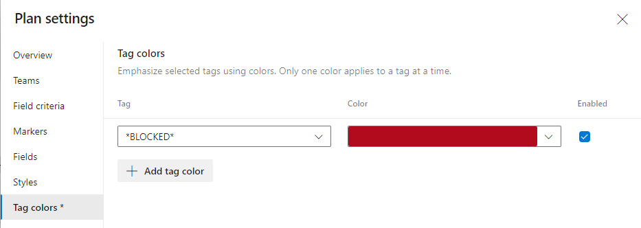
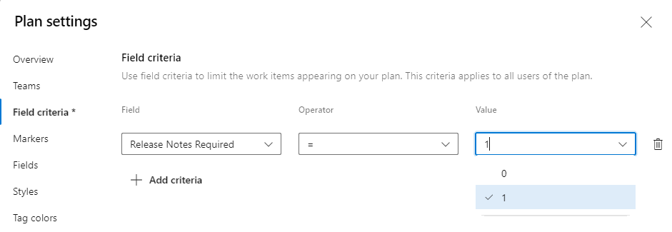

### Emphasize tags in Delivery Plans using colors

In Delivery Plans you can use styling rules to change cards when their corresponding work items meet rules that you set. With this update, we included **Tag colors** so you can now emphasize selected tags using colors. 

Prior to setting tag colors, first add tags to backlog items that you want to highlight with color. From the Settings dialog, choose Tag colors and then choose the :::image type="icon" source="../../media/green_plus_icon.png" border="false"::: plus icon. Then, select the tag and the color you want to appear on the cards. Save the settings when you are done with your changes. Please note that only one color applies to a tag at a time.

> [!div class="mx-imgBorder"]
> 

### Filter cards based on Boolean field types in Delivery Plans 

You can now filter the cards displayed based on a Boolean field type, Delivery Plans now supports the Boolean field type in the Styles and Field criteria sections of Plan settings.

> [!div class="mx-imgBorder"]
> 

### Work item title is always visible in Delivery Plan cards 

A pain point for customers using Delivery Plans was that the title of the work item wasn't always visible in the cards. We heard your feedback that this made it challenging to identify the work. Based on your feedback, we've made changes so that the title of a work item is always visible in the card.

### Show light green colored dependency icon for work items that have dependencies with no issues

With Delivery Plans, you can [track dependencies that have been added to work items](/azure/devops/boards/plans/track-dependencies?view=azure-devops&preserve-view=true). Work items that have dependencies will have a link icon in the card. With this update, we included colors to the link icon. Dependencies that have an issue will have a red link icon, and ones that do not have an issue will have a light green link icon.

> [!div class="mx-imgBorder"]
> 
