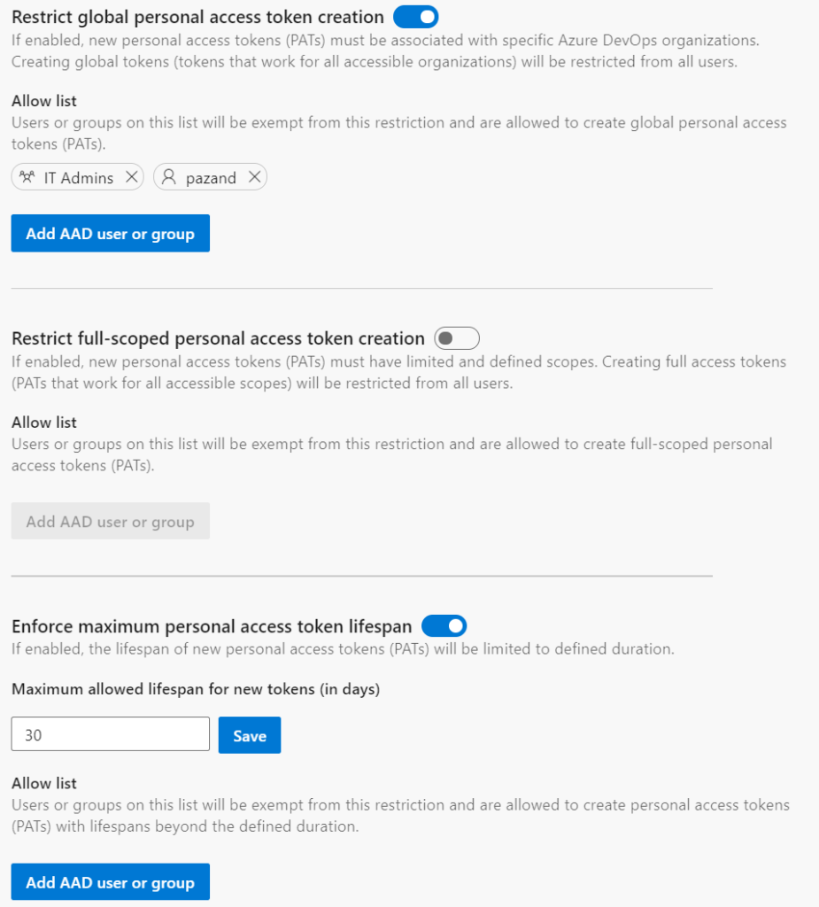

### Restrict personal access token (PAT) scope and lifespan via Azure AD tenant policy 

Personal access tokens (PATs) make it easy to authenticate against Azure DevOps to integrate with your tools and services. However, leaked tokens could compromise your Azure DevOps account and data, putting your applications and services at risk.

We received feedback about administrators not having the necessary controls to limit the threat surface area posed by leaked PATs. Based on these feedback, we’ve added a new set of policies which can be used to restrict the scope and lifespan of your organization’s Azure DevOps personal access tokens (PATs)! Here’s how they work:

Users assigned to the Azure DevOps Administrator role in Azure Active Directory can navigate to the **Azure Active Directory** tab in the organization settings of any Azure DevOps organization linked to their Azure AD.

> [!div class="mx-imgBorder"]
> 

There, administrators can:

1. restrict the creation of global personal access tokens (tokens that work for all Azure DevOps organizations accessible by the user)
2. restrict the creation of full-scoped personal access tokens
3. define a maximum lifespan for new personal access tokens

These policies will apply to all new PATs created by users for Azure DevOps organizations linked to the Azure AD tenant. Each of the policies have an allow list for users and groups who should be exempt from the policy. The list of users and groups in the Allow list will not have access to manage policy configuration.

These policies only apply to new PATs, and will not affect existing PATs that have already been created and are in use. After the policies have been enabled however, any existing, now non-compliant PATs must be updated to be within the restrictions before they can be renewed.