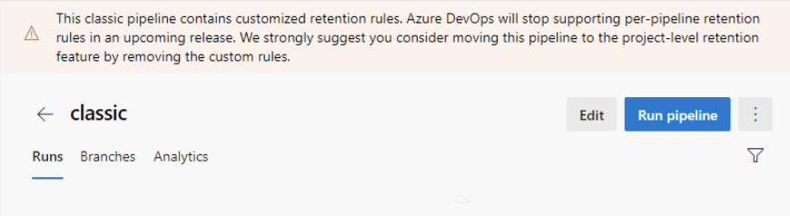
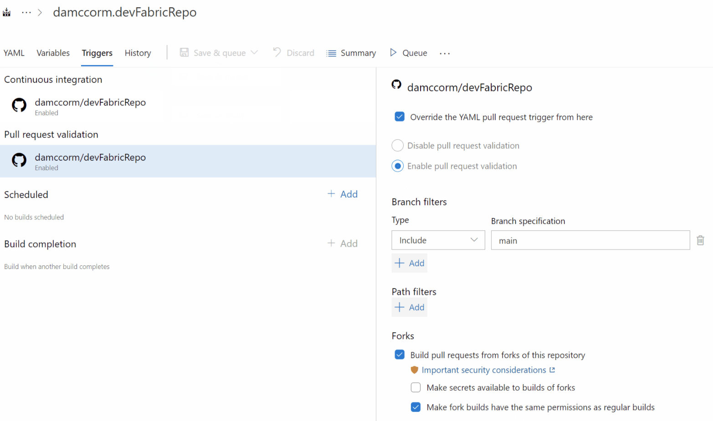

### Changes to Azure Pipelines free grants

Azure Pipelines has been offering free CI/CD to public and private projects for several years. Because this amounts to giving away free compute, it has always been a target for abuse – especially crypto mining. Minimizing this abuse has always taken energy from the team. Over the past few months, the situation has gotten substantially worse, with a high percentage of new projects in Azure DevOps being used for crypto mining and other activities we classify as abusive. Several service incidents over the past month have been caused by this abuse resulting in long wait times for existing customers.

To address this situation, we've added an extra step for new organizations in Azure DevOps to get their free grant. The following changes are effective immediately:

* By default, new organizations created in Azure DevOps will no longer get a free grant of concurrent pipelines. This applies to both public as well as private projects in new organizations.
* To request your free grant, send an email to azpipelines-freetier@microsoft.com and provide the following details clearly:
    * Your name
    * Azure DevOps organization for which you are requesting the free grant
    * Whether you need the free grant for public projects, private projects, or both
    * Links to the repositories that you plan to build (public projects only) 
    * Brief description of your project (public projects only) 

We will review your request and respond within a few days.

> [!NOTE]
> This change only impacts new organizations. It doesn't apply to existing projects or organizations. This does not change the amount of free grant you can get. It only adds an extra step to get that free grant.

We apologize for any inconvenience this may cause new customers wishing to use Azure Pipelines for CI/CD. We believe that this is necessary to continue providing a high level of service to all our customers. We will continue to explore automated ways of preventing abuse and will restore the previous model once we have a reliable mechanism to prevent abuse.
### Removal of per-pipeline retention policies in classic builds

You can now configure retention policies for classic builds and YAML pipelines in Azure DevOps project settings. While this is the only way to configure retention for YAML pipelines, you can also configure retention for classic build pipelines on a per-pipeline basis. We will remove all per-pipeline retention rules for classic build pipelines in an upcoming release. 

What this means for you: any classic build pipeline that still has per-pipeline retention rules will soon be governed by the project-level retention rules.

To help you identify these pipelines, we are rolling out a change in this release to show a banner at the top of the runs list page.

> [!div class="mx-imgBorder"]
> 

We recommend that you update your pipelines by removing the per-pipeline retention rules. If your pipeline specifically requires custom rules, you can use a custom task in your pipeline. For information on adding retention leases through a task, see the [set retention policies for builds, releases, and tests documentation](/azure/devops/pipelines/policies/retention?preserve-view=true&tabs=yaml&view=azure-devops#automatically-set-retention-lease-on-pipeline-runs).

### New controls for environment variables in pipelines

Azure Pipelines agent scans standard output for special [logging commands](/azure/devops/pipelines/scripts/logging-commands) and executes them. The `setVariable` [command](/azure/devops/pipelines/scripts/logging-commands?preserve-view=true&tabs=bash&view=azure-devops#setvariable-initialize-or-modify-the-value-of-a-variable) can be used to set a variable or modify a previously defined variable. This can potentially be exploited by an actor outside the system. For example, if your pipeline has a step that prints the list of files in an ftp server, then a person with access to the ftp server can add a new file, whose name contains the `setVariable` command and cause the pipeline to change its behavior.

We have many users that rely on setting variables using the logging command in their pipeline. With this release we are making the following changes to reduce the risk of unwanted uses of the `setVariable` command. 

* We've added a new construct for task authors. By including a snippet such as the following in `task.json`, a task author can control if any variables are set by their task.

```
{
    "restrictions": {
        "commands": {
            "mode": "restricted"
        },
        "settableVariables": {
            "allowed": [
                "myVar",
                "otherVar"
            ]
        }
    },
}​ 
```

* In addition, we are updating a number of built-in tasks such as ssh so that they cannot be exploited.

* Finally, you can now use YAML constructs to control whether a step can set variables.

```
steps:
- script: echo hello
  target:
    settableVariables: none
```

```
steps:
- script: echo hello
  target:
    settableVariables:
    - things
    - stuff
```    

### Generate unrestricted token for fork builds

GitHub users commonly use forks to contribute to an upstream repository. When Azure Pipelines builds contributions from a fork of a GitHub repository, it restricts the permissions granted to the job access token and does not allow pipeline secrets to be accessed by such jobs. You can find more information about the security of building forks in our [documentation](/azure/devops/pipelines/repos/github?preserve-view=true&tabs=yaml&view=azure-devops#contributions-from-forks).

The same restrictions apply by default when building forks of a GitHub Enterprise Server repository. This may be more restrictive than desired in such closed environments, where users might still benefit from an inner-source collaboration model. While you can configure a setting in a pipeline to make secrets available to forks, there is no setting to control the job access token scope. With this release, we are giving you control to generate a regular job access token even for builds of forks. 

You can change this setting from **Triggers** in pipeline editor. Before changing this setting, make sure that you fully understand the security implications of enabling this configuration.

> [!div class="mx-imgBorder"]
> 


### Change in Az, Azure, and Azure RM preinstalled modules

We are updating the process of pre-installing Az, Azure and AzureRM modules to Ubuntu and Windows hosted images for more efficient support and image space usage.


During the week of March 29th, all versions, except for the latest and the most popular one, will be stored as archives and will be extracted by Azure PowerShell task on demand. The detailed list of changes is below:


1. Windows images

    * All Az module versions except for latest one (currently, 5.5.0) will be archived

    * All Azure modules except for the latest one (currently, 5.3.0) and 2.1.0 will be archived

    * All AzureRM modules except for the latest one (currently, 6.13.1) and 2.1.0 will be archived


2. Ubuntu images

    * All Az modules except for the latest one (currently, 5.5.0) will be archived or removed completely from the image, and will be installed by the task on demand.

Any pipelines that use in-the-box Azure tasks on hosted agents will work as intended and will not require updates. If you do not use these tasks, switch your pipelines to using Azure PowerShell task to avoid changes to pre-installed modules.

> [!NOTE]
> These updates will not affect pipelines running on self-hosted agents.