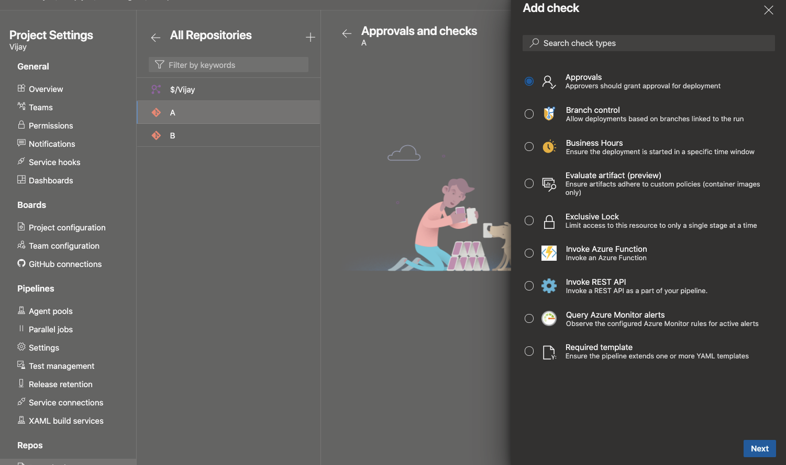
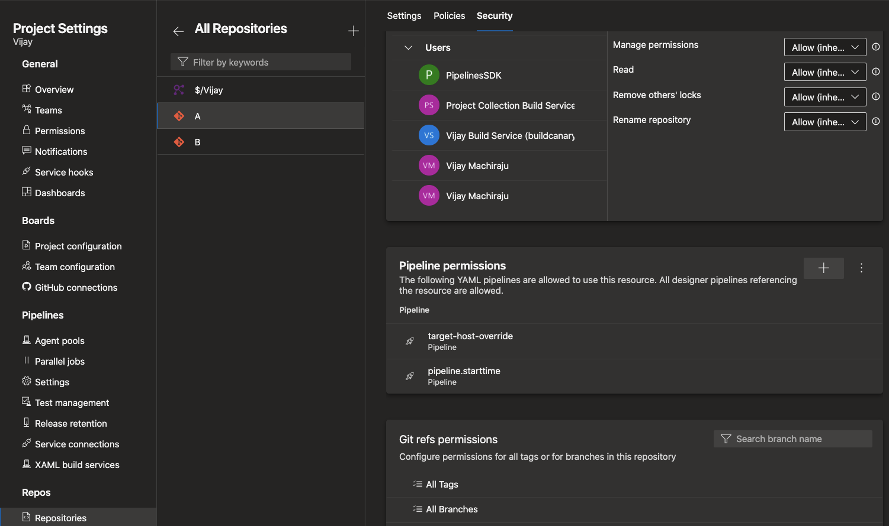

### Repos as a protected resource in YAML pipelines

You may organize your Azure DevOps project to host many sub-projects - each with its own Azure DevOps Git repository and one or more pipelines. In this structure, you may want to control which pipelines can access which repositories. For example, let us say that you have two repositories A and B in the same project and two pipelines X and Y that normally build these repositories. You may want to prevent pipeline Y from accessing repository A. In general, you want the contributors of A to control which pipelines they want to provide access to.

While this was partially possible with Azure Git repositories and pipelines, there was no experience for managing it. This feature addresses that gap. Azure Git repositories can now be treated as [protected resources](/azure/devops/pipelines/security/resources) in YAML pipelines, just like service connections and agent pools.

As a contributor of repo A, you can add checks and pipeline permissions to your repository. To do this, navigate to the project settings, select Repositories, and then your repository. You will notice a new menu called "Checks", where you can configure any of the in-the-box or custom checks in the form of Azure functions. 

> [!div class="mx-imgBorder"]
> 

Under the "Security" tab, you can manage the list of pipelines that can access the repository. 

> [!div class="mx-imgBorder"]
> 

Anytime a YAML pipeline uses a repository, the Azure Pipelines infrastructure verifies and ensures that all the checks and permissions are satisfied.

> [!NOTE]
> These permissions and checks are only applicable to YAML pipelines. Classic pipelines do not recognize these new features.