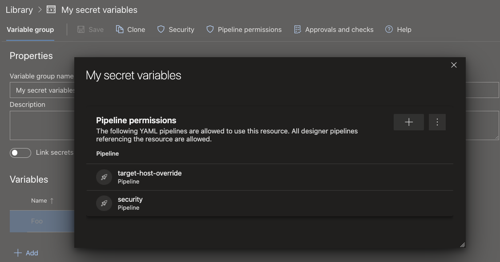
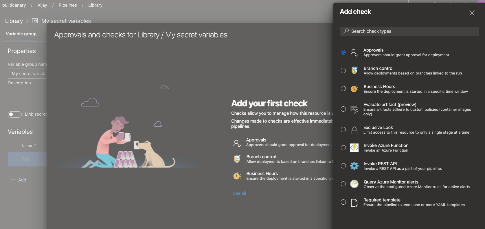

### Change in .NET SDK preinstallation policy on Microsoft hosted Ubuntu agents

We are changing the .NET SDK versions that are pre-installed on Microsoft-hosted Ubuntu agents. Currently, we install all available and supported versions of .NET SDK (2.1.x, 3.1.x, 5.0.x). This approach will be changed in favor of installing the latest patch version for every feature version. This change is being made to provide you with more free space and for new tool requests. For more information, see our [software and image guidelines](https://github.com/actions/virtual-environments/blob/main/docs/software-and-images-guidelines.md).

#### What does it mean?

The SDK version is composed of the following parts: `x.y.znn`. `z` is the feature version and `nn` is the patch version. For example, for 2.1.302, the feature version is 3, and 02 is the patch version. According to the new approach, we will only install the latest patch version for every feature version, i.e. only 2.1.302 will be installed for 2.1.3x, only 2.1.403 for 2.1.4x and so on. All versions of the .NET SDK that are not the latest patch versions will be removed from Ubuntu images on June 14. This change impacts all the versions of Ubuntu on Microsoft-hosted agents.

#### Target date

Deployment of updated images will start June 14 and will take 3-4 days.

#### Possible impact

If you use a [global.json file](https://docs.microsoft.com/dotnet/core/tools/global-json), your build will be affected in the following cases:

Your build will fail, if the global.json file contains the `rollForward: disable` property and SDK version that is not the latest patch version. For example:
```
{
  "sdk": {
    "version": "3.1.100",
    "rollForward": "disable"
  }
}
```

.NET SDK version will be automatically changed to the latest patch if the global.json file contains the `rollForward: patch` property. For example:
```
{
  "sdk": {
    "version": "3.1.100",
    "rollForward": "patch"
  }
}
```

If the `rollForward` field is not specified in your global.json file, there will be no change for you. The latest installed patch level is used.

If you need to use the exact .NET SDK version that is not the latest patch, please use [`UseDotNet` task](https://docs.microsoft.com/azure/devops/pipelines/tasks/tool/dotnet-core-tool-installer?view=azure-devops) to install it as part of the build:

``` YAML
steps:
- task: UseDotNet@2
  displayName: 'Use .NET Core sdk'
  inputs:
    version: <dotnet version>
```
### Permissions and checks on variable groups and secure files

You can use different types of [shared resources](https://docs.microsoft.com/azure/devops/pipelines/process/about-resources?view=azure-devops) in YAML pipelines. Examples include service connections, variable groups, secure files, agent pools, environments, or repositories. To protect a pipeline from accessing a resource, the owner of the resource can configure permissions and checks on that resource. Every time a pipeline tries to access the resource, all the configured permissions and checks are evaluated. These protections have been available on service connections, environments, and agent pools for a while. They were recently added to [repositories](https://docs.microsoft.com/azure/devops/pipelines/process/repository-resource?view=azure-devops). With this release, we are adding the same protections to variable groups and secure files.

To restrict access to a variable group or a secure file to a small set of pipelines, use the **Pipelines permissions** feature.

> [!div class="mx-imgBorder"]
> 

To configure checks or approvals that should be evaluated every time a pipeline runs, use the **Approvals and checks for Library** feature.

> [!div class="mx-imgBorder"]
> 

### Preview of templates support in YAML editor

[Templates](https://docs.microsoft.com/azure/devops/pipelines/process/templates?view=azure-devops) are a commonly used feature in YAML pipelines. They are an easy way to share pipeline snippets. They are also a powerful mechanism in verifying or enforcing [security and governance](https://docs.microsoft.com/azure/devops/pipelines/security/templates?view=azure-devops) through your pipeline.

Azure Pipelines supports a YAML editor which can be handy when editing your pipeline. Previously, the editor did not support templates. Authors of YAML pipelines could not get intellisense assistance when using a template. With this release, we are previewing support for templates in the YAML editor. To enable this preview, navigate to preview features in your Azure DevOps organization, and enable **YAML templates editor**.

> [!div class="mx-imgBorder"]
> 

As you edit your main Azure Pipelines YAML file, you can either _include_ or _extend_ a template. When you type in the name of your template, you will be prompted to validate your template. Once validated, the YAML editor understands the schema of the template including the input parameters.

> [!div class="mx-imgBorder"]
> 

Post validation, you can choose to navigate into the template. You will be able to make changes to the template using all the features of the YAML editor.

Please note that this feature is in preview. There are known limitations, some of which we are working to address.
If the template has required parameters that are not provided as inputs in the main YAML file, then the validation fails and prompts you to provide those inputs. In an ideal experience, the validation should not be blocked and you should be able to fill in the input parameters using intellisense. In addition, you cannot create a new template from the editor. You can only use or edit existing templates.

### Ubuntu-16.04 will be removed from Microsoft-hosted pools in September 2021

Traditional 5-years support of Ubuntu 16.04 by Canonical [ends in April, 2021](https://ubuntu.com/16-04). To keep our environment updated and secured, we will remove Ubuntu 16.04 on September 20, 2021.

You will need to migrate ubuntu-16.04 workflows to ubuntu-18.04 or ubuntu-latest which will run on Ubuntu 20.04 LTS.

To make sure everyone is aware of this change, we have scheduled two short brownouts. Any Ubuntu 16.04 builds will fail during the brownout period. Therefore, it is recommended to migrate your pipelines prior to September 6, 2021.

The brownouts are tentatively scheduled for the following dates and times. We will update these times as we get closer to this period.

September 6, 2021 5:00pm UTC – 10:00pm UTC

September 14, 2021 5:00pm UTC – 10:00pm UTC