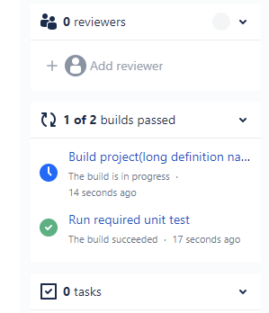
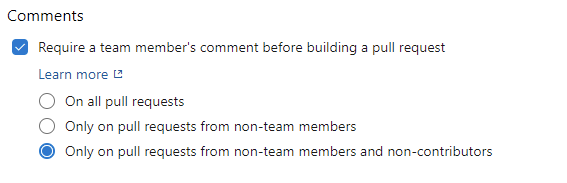

### New YAML conditional expressions

Writing conditional expressions in YAML files just got easier with the use of `${{ else }}` and `${{ elseif }}` expressions. Below are examples of how to use these expressions in YAML pipelines files. 

```
steps:
- script: tool
  env:
    ${{ if parameters.debug }}:
      TOOL_DEBUG: true
      TOOL_DEBUG_DIR: _dbg
    ${{ else }}:
      TOOL_DEBUG: false
      TOOL_DEBUG_DIR: _dbg
```

```
variables:
  ${{ if eq(parameters.os, 'win') }}:
    testsFolder: windows
  ${{ elseif eq(parameters.os, 'linux' }}:
    testsFolder: linux
  ${{ else }}:
    testsFolder: mac
```

### Support for wild cards in path filters

[Wild cards](https://docs.microsoft.com/azure/devops/pipelines/repos/azure-repos-git?view=azure-devops&tabs=yaml#wildcards) can be used when specifying inclusion and exclusion branches for CI or PR triggers in a pipeline YAML file. However, they cannot be used when specifying path filters. For instance, you cannot include all paths that match `src/app/**/myapp*`. This has been pointed out as an inconvenience by [several customers](https://developercommunity.visualstudio.com/t/support-wildcards-in-trigger-path-filters-1/366363). This update fills this gap. Now, you can use wild card characters (`**`, `*`, or `?`) when specifying path filters.
### Support for multiple statuses in Bitbucket

Azure Pipelines integrates with Bitbucket repositories and supports CI and PR triggers. You can set up multiple pipelines from a single Bitbucket repository. However, when these pipelines were complete, you could only see one status in Bitbucket. We heard feedback from the [Developer Community](https://developercommunity.visualstudio.com/t/Bitbucket-Build-Status-with-Multiple-Pip/928225) asking to view the status of each pipeline separately in Bitbucket. With this update, we updated our API calls to Bitbucket and pass additional information about the name of the pipeline.

> [!div class="mx-imgBorder"]
> 
### Allow contributors to skip seeking PR comments prior to build validation

When using Azure Pipelines with GitHub repositories, we [recommend](https://docs.microsoft.com/azure/devops/pipelines/repos/github?view=azure-devops&tabs=yaml#contributions-from-forks) that you don't automatically run a PR validation pipeline for contributions received from a forked repository. The best practice here is to first have one of the collaborators of the repository review the change and then add a [comment](https://docs.microsoft.com/azure/devops/pipelines/repos/github?view=azure-devops&tabs=yaml#comment-triggers) to the PR to trigger the pipeline. You can configure these settings by selecting the Triggers menu (for YAML pipelines) or the Triggers tab (for classic build pipelines) in the pipeline web editor. Instead of requiring every PR from a fork to be first reviewed by a team member, you can also enforce this policy only on contributions that originate from non-team members.

With this update, we are allowing you to skip seeking a PR comment from contributions received by any contributor. As a non-team member, when you create a fork and create a PR to the upstream, you are not considered a contributor to the upstream repository until your PR is merged. Once your PR is merged, you will be considered a contributor. By selecting the new option shown below, when a non-team member submits a PR from a fork for the first time, someone on your team would have to review the PR and add a comment to trigger the pipeline. But, once the PR is merged, any further contributions made by that non-team member will directly trigger the pipeline without waiting for a PR comment.

> [!div class="mx-imgBorder"]
> 

### Windows Server 2022 with Visual Studio 2022 is now available on Microsoft-hosted agents (preview)

Windows Server 2022 and [Visual Studio Enterprise 2022 Preview](https://visualstudio.microsoft.com/vs/preview/) are now available in preview on Microsoft-hosted agents. You can use it by referencing `windows-2022` as image in your pipeline.

```yaml
pool:
  vmImage: 'windows-2022'

steps:
- task: NuGetToolInstaller@1
- task: NuGetCommand@2
  inputs:
    restoreSolution: '**/*.sln'
- task: VSBuild@1 # Visual Studio 2022 build
  inputs:
    solution: '**/*.sln'
    msbuildArgs: '/p:DeployOnBuild=true /p:WebPublishMethod=Package /p:PackageAsSingleFile=true /p:SkipInvalidConfigurations=true /p:DesktopBuildPackageLocation="$(build.artifactStagingDirectory)\WebApp.zip" /p:DeployIisAppPath="Default Web Site"'
    platform: 'Any CPU'
    configuration: 'Release'
```

When you reference windows-latest pool in your YAML pipelines, it will still mean windows-2019 and not windows-2022, while the latter is in preview.

The Windows Server 2022 pipeline image has different tools and tool versions when compared to Windows Server 2019. You can see the details in the software [announcement issue](https://github.com/actions/virtual-environments/issues/3949) and in the documentation [virtual-environments repository](https://github.com/actions/virtual-environments/blob/main/images/win/Windows2022-Readme.md).

If you find any issues with your pipelines when using Windows Server 2022, please let us know by creating an issue in the [virtual-environments repository](https://github.com/actions/virtual-environments/blob/main/docs/software-and-images-guidelines.md).

### General availability of macOS 11 on Microsoft-hosted agents

macOS 11 is now generally available on Microsoft-hosted agents. You can use it by referencing `macos-11` as image in your pipeline.

```yaml
pool:
  vmImage: macos-11
```

The macOS 11 pipeline image has different tools and tool, to learn more about this version you can see the full documentation [here](https://github.com/actions/virtual-environments/blob/main/images/macos/macos-11-Readme.md).

If you find any issues with your pipelines when using macOS 11, please let us know by creating an issue in the [virtual-environments repository](https://github.com/actions/virtual-environments/blob/main/docs/software-and-images-guidelines.md).

### Removal of Ubuntu 16.04 image on Microsoft-hosted agents

As announced [earlier](https://docs.microsoft.com/azure/devops/release-notes/2021/pipelines/sprint-187-update#ubuntu-1604-will-be-removed-from-microsoft-hosted-pools-in-september-2021), we will be removing Ubuntu 16.04 image from Microsoft-hosted agents on September 20, 2021. Traditional 5-years support of Ubuntu 16.04 by Canonical ended in April, 2021. You will need to migrate ubuntu-16.04 pipelines to ubuntu-18.04 or ubuntu-latest which will run on Ubuntu 20.04 LTS.

Builds that use Ubuntu-16.04 already have a warning being logged in them. To make sure everyone is aware of this change, we scheduled 2 short "brownouts". Ubuntu 16.04 builds will fail during the brownout period. Therefore, it is recommended to migrate your workflows prior to the September 6, 2021.

The brownouts are scheduled for the following dates and times (Note that these have been extended by an hour from the earlier announced times):
September 6, 2021 4:00pm UTC – 10:00pm UTC
September 14, 2021 4:00pm UTC – 10:00pm UTC