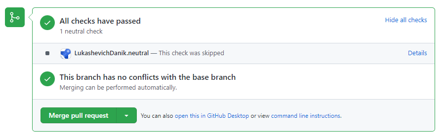
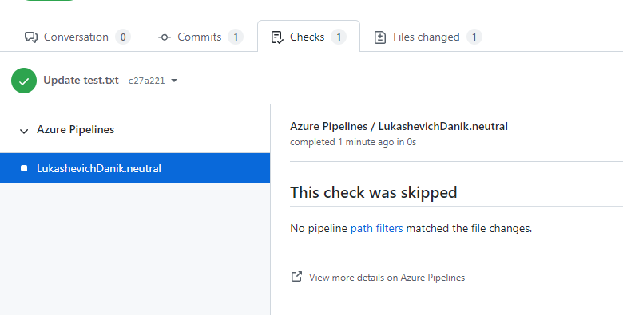
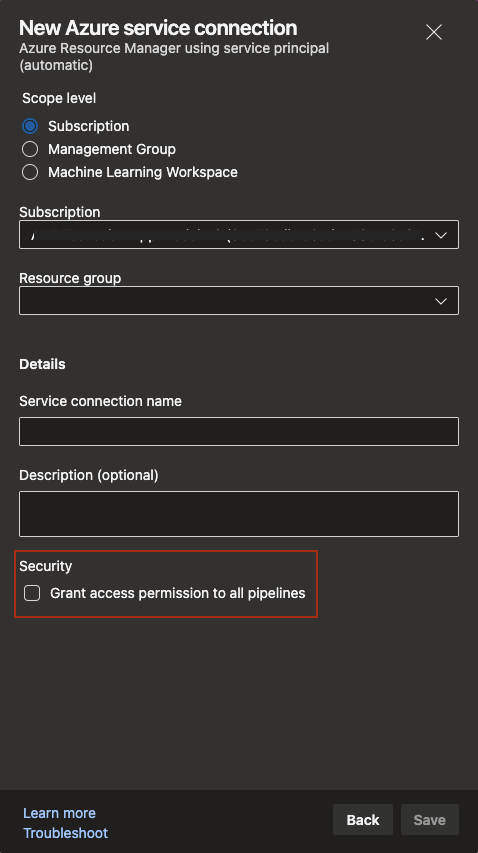

### Post neutral status to GitHub when a build is skipped 

With Azure Pipelines, you could always [validate a pull request](/azure/devops/pipelines/repos/github?view=azure-devops&preserve-view=true&tabs=yaml#pr-triggers) in GitHub. You could also specify which [paths](/azure/devops/pipelines/repos/github?view=azure-devops&preserve-view=true&tabs=yaml#paths) in your GitHub repo should trigger a pipeline. For instance, the following pipeline is triggered when a change is pushed to `code` in the `main` branch, but not triggered when a change is pushed to the `docs` folder.

```
trigger: none

pr:
 branches:
   include:
     - main
 paths:
   include:
     - code
   exclude:
     - docs

pool:
  vmImage: ubuntu-latest

steps:
- script: echo Hello, world!
  displayName: 'Run a one-line script'

```

Once the pipeline completes, Azure Pipelines would post a status back to GitHub. If you had branch protection policies in effect for your GitHub repository, then the status posted by Azure Pipelines determined whether the pull request would be merged.

In the above example, if you made a change to `docs`, GitHub currently blocks the pull request waiting for a status to be returned by Azure Pipelines. However, Azure Pipelines does not run a validation build since that path is excluded from the trigger, making it impossible to complete the pull request. Customers setting up path exclusion triggers or multiple pipelines for a single GitHub repo often faced this challenge.

Moving forward, Azure Pipelines will post a `neutral` status back to GitHub when it decides not to run a validation build because of a path exclusion rule. This will provide a clear direction to GitHub indicating that Azure Pipelines has completed its processing.

Conversation view:
> [!div class="mx-imgBorder"]
> 

Check details:
> [!div class="mx-imgBorder"]
> 

### Access to all pipelines is turned off by default in protected resources

A YAML pipeline can rely on one or more [protected resources](/azure/devops/pipelines/security/resources). Service connections, agent pools, variable groups, secure files, and repositories are all examples of protected resources since an administrator of such a resource can control which pipelines have access to that resource. Administrators use the security settings panel of the resource to enable or disable pipelines.

When you create one of these resources, the default experience grants access to all pipelines unless you turn it off explicitly. Moving forward, to improve the overall security posture, the default is being set to deny access to all pipelines. To grant access to all pipelines, simply turn on the toggle in the creation experience or after the resource is created.

> [!div class="mx-imgBorder"]
> 

### Inject task before or after specified target tasks using a decorator

[Decorators](/azure/devops/extend/develop/add-pipeline-decorator) are a way to automatically inject tasks into a pipeline. They are commonly used by central teams in an organization to automatically run required compliance procedures. Decorators can be used with classic builds, classic releases, or YAML pipelines.

Currently, a task can be injected through a decorator at the beginning of every job, at the end of every job, or right after a check-out task. To control this, you specify a `target` in the contribution section of the decorator's extension as described [here](/azure/devops/extend/develop/add-pipeline-decorator?view=azure-devops&preserve-view=true#author-a-pipeline-decorator). We are now expanding the list of targets to include the following:

```
ms.azure-pipelines-agent-job.pre-task-tasks
ms.azure-pipelines-agent-job.post-task-tasks
ms.azure-release-pipelines-agent-job.pre-task-tasks
ms.azure-release-pipelines-agent-job.post-task-tasks
```

Here is an example of a decorator that injects a task before every instance of a [`PublishPipelineArtifacts`](https://github.com/microsoft/azure-pipelines-tasks/blob/master/Tasks/PublishPipelineArtifactV1/task.json) task into a pipeline.

```
{
    "manifestVersion": 1,
    "contributions": [
        {
            "id": "my-required-task",
            "type": "ms.azure-pipelines.pipeline-decorator",
            "targets": [
                "ms.azure-pipelines-agent-job.pre-task-tasks"
            ],
            "properties": {
                "template": "my-decorator.yml",
                "targettask": "ECDC45F6-832D-4AD9-B52B-EE49E94659BE"
            }
        }
    ],
    "files": [
        {
            "path": "my-decorator.yml",
            "addressable": true,
            "contentType": "text/plain"
        }
    ]
}
```

### Announcing a deprecation schedule for Windows 2016 hosted images

Recently, we made Windows 2022 available as a hosted image. With the upcoming end of mainstream support for Windows 2016 in [January 2022](/lifecycle/products/windows-server-2016), we are deprecating `vs2017-win2016` images starting November 15. The complete retirement of this image is planned for March 2022. Since this is a commonly used image, we wanted to give you enough notice and time to make necessary changes to your pipelines.

Refer to our [blog post](https://devblogs.microsoft.com/devops/hosted-pipelines-image-deprecation/) detailing how to find all projects and pipelines using Windows 2016 hosted image and the steps you can take to migrate to newer versions.

### Announcing deprecation of macOS 10.14 hosted images

Recently, we made macOS-11 available as a hosted image. As a result, we will be deprecating macOS-10.14 image in December 2021. Builds that rely on this image will fail once it is deprecated. You can find more details about the deprecation of various images from our [blog post](https://devblogs.microsoft.com/devops/hosted-pipelines-image-deprecation/). 