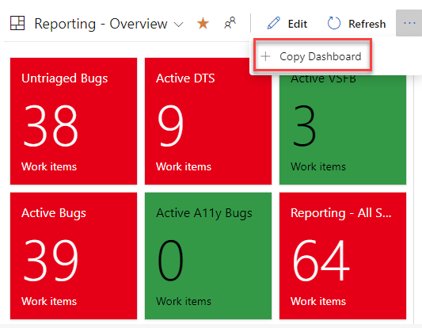
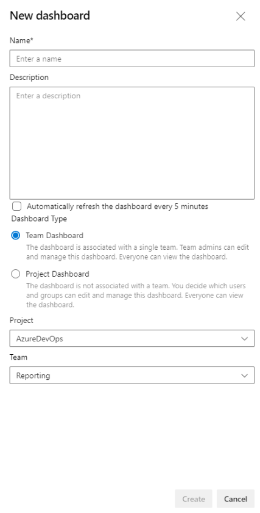
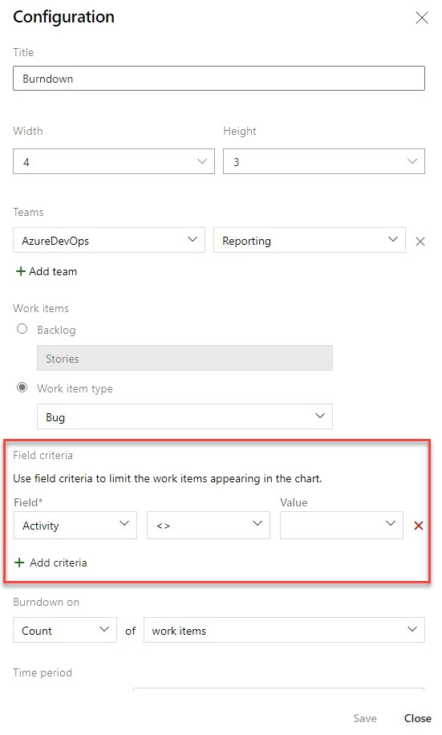

### Copy Dashboard improvements

We are excited to announce the phase 2 public preview of Copy Dashboard! Queries and configuration are now carried over with the copy operation. Thanks for your patience as it took a little longer than expected to work out some of the issues.

The preview is on by default with the **Copy Dashboard Experience** feature flag (under preview features).

To copy a dashboard, first go to the dashboard you want to copy. Second, click the menu to bring up **Copy Dashboard** and then click on it.

> [!div class="mx-imgBorder"]
> 

Next, provide the name and description of the new dashboard, and then select the dashboard type, Team or Project. When selecting a Team Dashboard, the new project and team are selected from the respective drop down boxes. For a Project dashboard, only the project is required.

> [!div class="mx-imgBorder"]
> 

You’ll be taken to the newly created dashboard after clicking the **Create** button. The widgets and layout remain the same.

Behind the scenes a folder with the name of the new dashboard is created in **Shared Queries**. All the queries for the new dashboard are copied to that folder. Query names remain the same. Widgets with a Team configuration are updated with the new team. Widgets with a Team configuration being copied from a Team dashboard to a Project Dashboard retain the original configuration.

### Filter on null values in burndown chart widget

You can now filter on a null value when using Field Criteria in the burndown chart widget. This behavior is now consistent with a query using the same field criteria. 

> [!div class="mx-imgBorder"]
> 