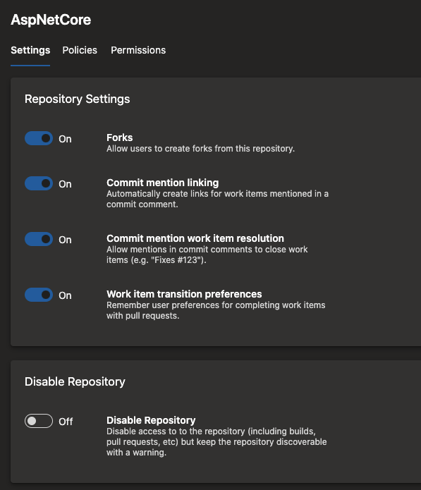

### Disable a repository

Customers have often requested a way to disable a repository and prevent users from accessing its contents. For example, you may want to do this when:

* You found a secret in the repository.
* A third-party scanning tool found a repository to be out of compliance.

In such cases, you may want to temporarily disable the repository while you work to resolve the issue. With this update, you can disable a repository if you have *Delete repository* permissions. By disabling a repo, you:

* Can list the repo in the list of repos
* Cannot read the contents of the repo
* Cannot update the contents of the repo
* See a message that the repo has been disabled when they try to access the repo in the Azure Repos UI

After the necessary mitigation steps have been taken, users with *Delete repository* permission can re-enable the repository. To disable or enable a repository, go to Project Settings, select Repositories, and then the specific repo.

> [!div class="mx-imgBorder"]
> 