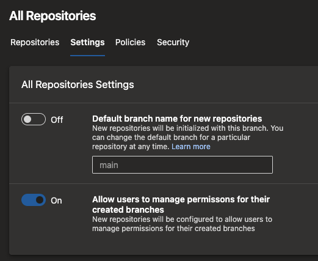

### New TFVC pages are generally available

We have been updating various pages in Azure DevOps to use a new web platform with the goal of making the experience more consistent and more accessible across the various services. TFVC pages have been updated to use the new web platform, and those changes have been in preview for several months now. With this update, we are making the new TFVC pages generally available. With this update, you will no longer see a preview feature called "New TFVC pages" in their user settings.

### Configure branch creators to not get "Manage permissions" on their branches

When you create a new branch, you get "Manage permissions" on that branch. This permission lets you change the permissions of other users or admit additional users to contribute to that branch. For instance, a branch creator may use this permission to allow another external user to make changes to the code. Or, they may allow a pipeline (build service identity) to change the code in that branch. In certain organizations with higher compliance requirements, users should not be able to make such changes.

With this update, you can configure any and all repositories in your team project and restrict branch creators from getting the "Manage permissions" permission. To do this, navigate to the project settings, select Repositories, and then Settings for all repositories or a specific repository.

> [!div class="mx-imgBorder"]
> 

This setting is on by default to mimic the existing behavior. But, you can turn it off if you wish to make use of this new security feature.

## Prevent fork users from voting on their upstream PRs

With Azure Repos, users with "read" permission on a repository can fork the repo and make changes in their fork. To submit a pull request with their changes to the upstream, users need "contribute to pull requests" permission on the upstream. However, this permission also governs who can vote on pull requests in the upstream repository. As a result, you can end up in situations where a user, who is not a contributor to the repository, can submit a pull request and cause it to be merged depending on how you set up the branch policies.

In organizations that promote an inner-source model, fork-and-contribute is a common pattern. To secure and promote this pattern further, we are changing the permission to vote on a pull request from "contribute to pull requests" to "contribute". However, this change is not being made by default in all organizations. You have to opt-in and select a new policy on your repository, called "Strict Vote Mode" to switch this permission. We recommend that you do so if you rely on forks in Azure Repos.

> [!div class="mx-imgBorder"]
> 