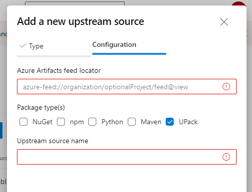

### Upstream cross-organization packages

Azure Artifacts now supports the ability to ingest Universal Packages (UPack) from other Azure DevOps organizations using upstreams. Upstreams for Universal Packages are configured the same as upstreams for any other package type. From your feed settings, click on **Add Upstream**, and then **Azure Artifacts feed in another organization**.  Universal Packages is now listed as an option for package type(s).

> [!div class="mx-imgBorder"]
> 