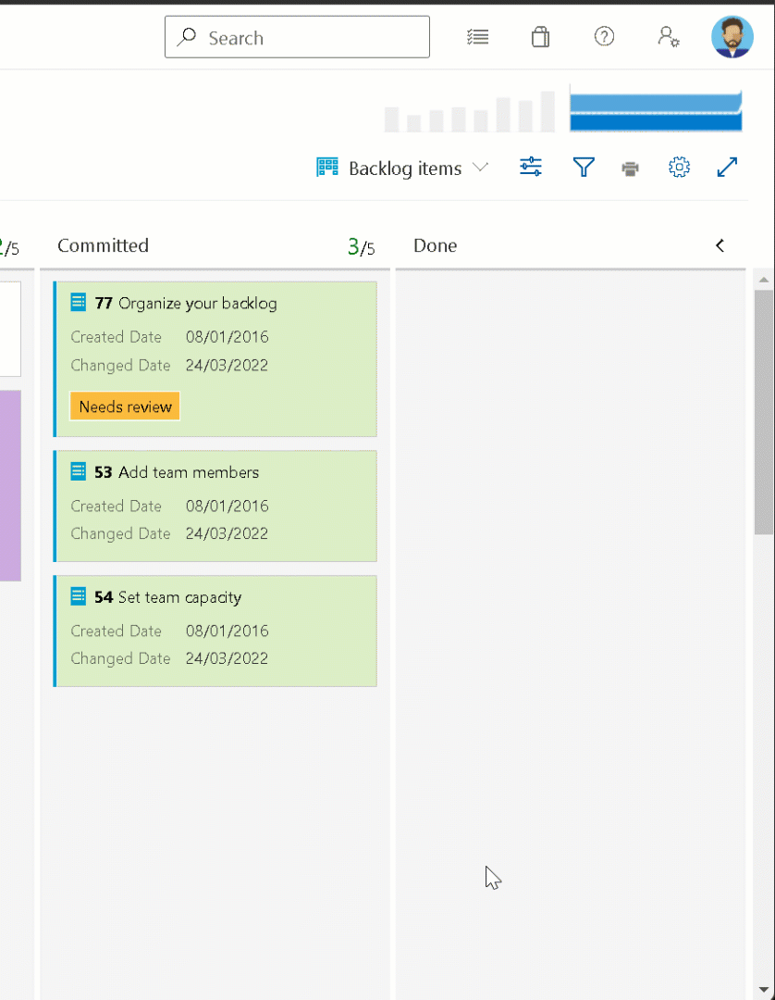

### New Boards Hubs now available in public preview

For the last several months our team has been focused on modernizing the user experience for the Azure Boards Hubs. The UI has been updated to provide a faster user interface, consistency with other parts of the product, and improved accessibility. The team is excited to finally announce the public preview for the new Azure Boards experience.

The functionality remains the same, but you can expect the following:

* Modern design
* Responsive reflows
* Improved performance
* Accessibility compliance

To opt-in to the public preview, in the preview features section toggle the feature named **New Boards Hubs** to On.

> [!div class="mx-imgBorder"]
> 

If for some reason the **New Boards Hubs** are causing you a blocking issue, you can turn off the preview. But please try the new experience and [send us your feedback](mailto:dahellem@microsoft.com). Be sure to let us know if anything is missing or not working as expected.