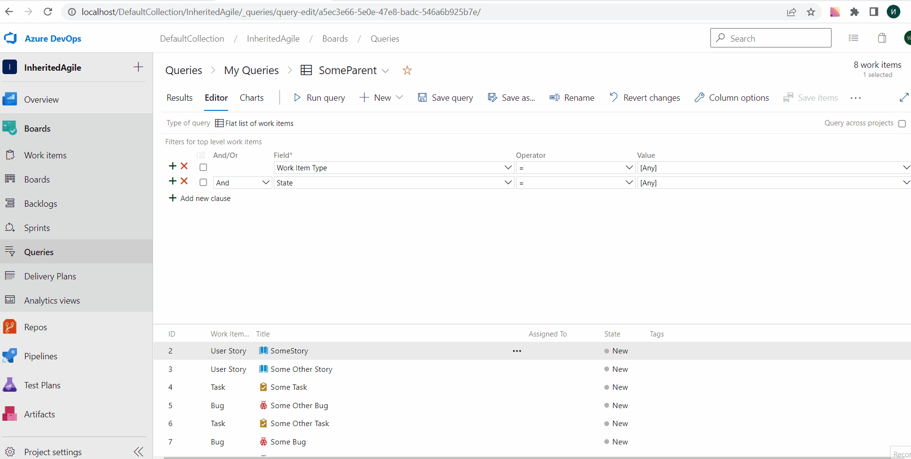
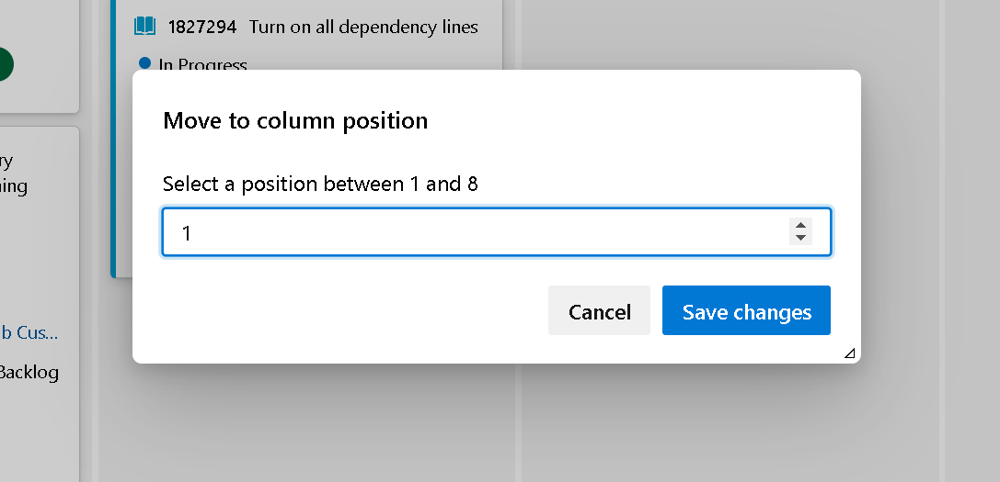

### Query by Parent Id (private preview)

We added the ability to query work items by Parent. This has been a long time ask from customers who are looking for a way to get a flat list of children based on the parent. The feature will start as a private preview to ensure query performance is not affected. If you are interested in participating in the private preview, please [send us an email](mailto:dahellem@microsoft.com) with your organization name.

> [!div class="mx-imgBorder"]
> 

### Move to column position on Kanban Board

The Kanban board helps you visualize your team's flow of work. Each column in the Kanban board represents a work stage. Each card represents a backlog item, user story, or bug at that stage of work. Now, you can re-order the work items within a Kanban board column by using **Move to position**. This will make it easier to re-order work items in columns that contain a lot of work items. To move a work item, click the actions icon (:::image type="icon" source="../../media/icons/actions-icon.png" border="false":::), and select **Move to position**.

> [!div class="mx-imgBorder"]
> 

> [!NOTE]
> The **Move to position** feature is available with the [**New Boards Hubs** preview](https://devblogs.microsoft.com/devops/new-boards-hub-public-preview/). 

### Added "Will not Fix" value to Bug reason field

As with all other work item types, the Bug work item type has a well-defined workflow. Each workflow consists of three or more States and a Reason. Reasons specify why the item transitioned from one State to another. With this update, we added a **Will not fix** reason value for the Bug work item types in the Agile process. The value will be available as a reason when moving Bugs from New or Active to Resolved. You can learn more about how to [define, capture, triage, and manage software bugs in Azure Boards documentation](/azure/devops/boards/backlogs/manage-bugs).