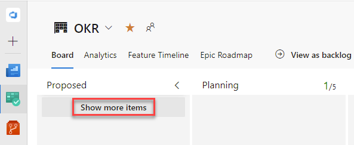
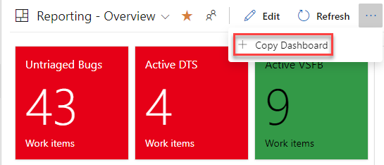
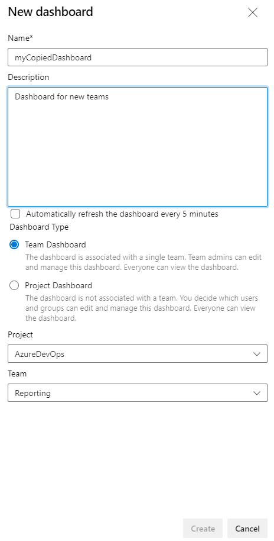

### Improved "Show more items" UX 

The Kanban board gives you a visual interactive space, which provides a visual flow of work. Boards present work items as cards and support quick status updates through drag-and-drop, similar to sticky notes on a physical whiteboard. 

Previously, the Kanban board **Show more items** feature fetched the next 200 work items, regardless of your filter. With this update, we have improved that experience by using the filter to generate a more specific search. When the filter is applied and you click the **Show more items** button, the system will use the filter to generate and execute a more specific Work Item Query Language (WIQL) query. This should eliminate the need to re-click the **Show more items** button.

> [!div class="mx-imgBorder"]
> 

> [!NOTE]
> This feature is available with the [**New Boards Hubs** preview](https://devblogs.microsoft.com/devops/new-boards-hub-public-preview/). 

### General availability of Copy Dashboard

Copy Dashboard is now generally available. Copy Dashobard lets you copy a dashboard to the same or a new project. To copy a dashboard:

1. Go to the dashboard you want to copy. From there click the menu to bring up **Copy Dashboard** and then click on it.

> [!div class="mx-imgBorder"]
> 

2. Enter the name and description of the new dashboard, then select the dashboard type, Team or Project. When selecting a Team Dashboard, the new project and team are selected from the project and team drop down boxes respectively. For a Project dashboard, only the project is required.

> [!div class="mx-imgBorder"]
> 