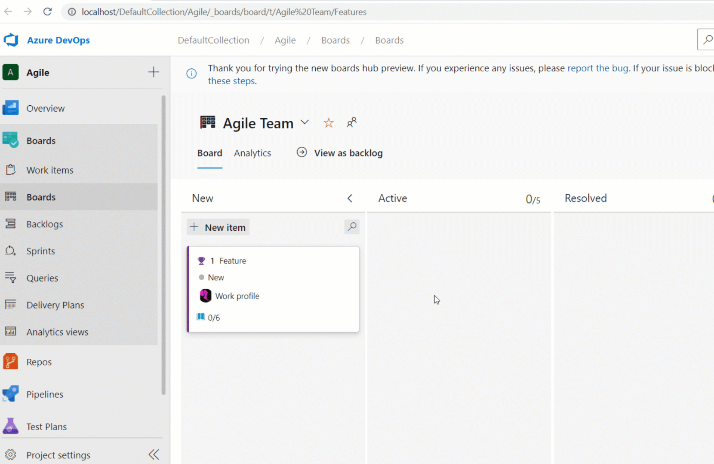
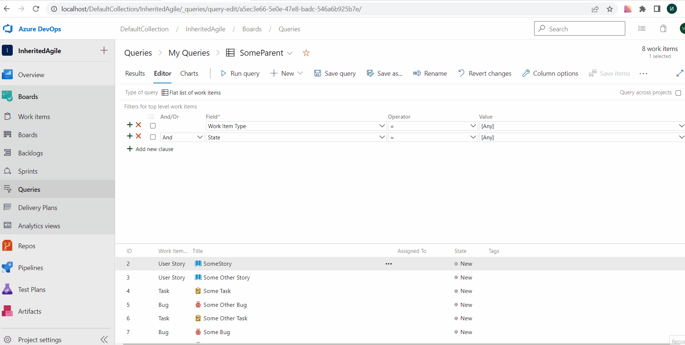

### Assigned To children in Kanban cards

We have added the **Assigned To** avatar to all child items on the Kanban board cards. This now makes it easier to understand what items have been assigned and to whom. You can also use the context menu to quickly assign the work item. 

> [!div class="mx-imgBorder"]
> 

> [!NOTE]
> This feature is available with the [**New Boards Hubs** preview](https://devblogs.microsoft.com/devops/new-boards-hub-public-preview/).

### General availability of Query by Parent Id

With this update, we are generally releasing the ability to query work items by Parent Id. This is a great feature if you are looking for ways to get a flat list of children based on the parent. 

> [!div class="mx-imgBorder"]
> 