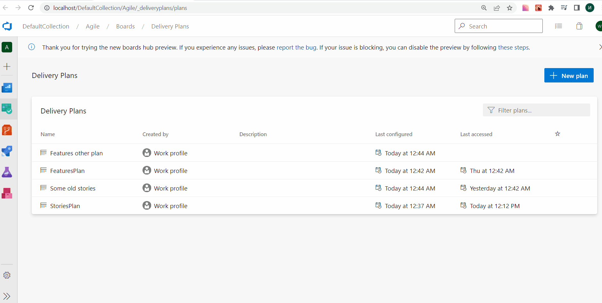
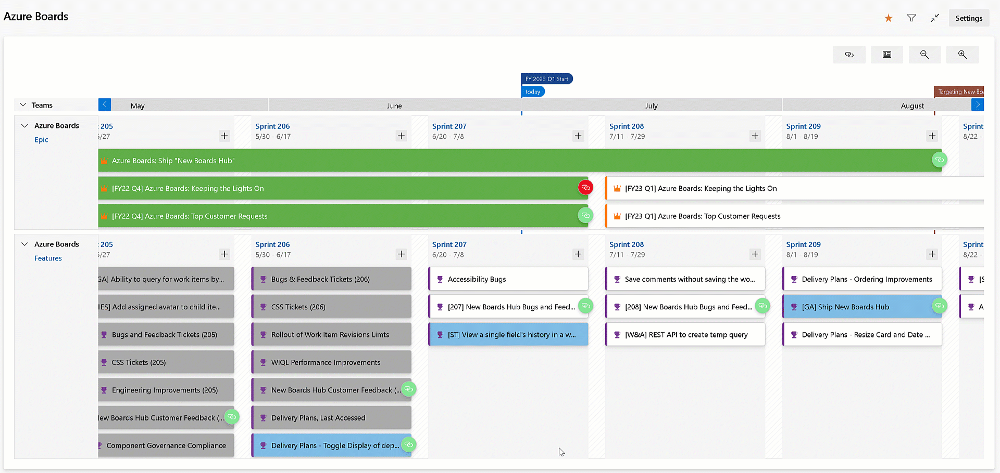

### Filter on work item history

Work items are designed with collaboration in mind. They also keep track of every change for full traceability. This can create a long revision history making it difficult to understand when changes happen to specific fields. In this sprint, we have added a filter option to the work item history tab. This allows you to quickly find revisions made to individual fields by specific people. 

> [!div class="mx-imgBorder"]
> 

We prioritized this feature based on one of the top suggestion from the [Developer Community](https://developercommunity.visualstudio.com/t/view-a-single-fields-history-in-a-work-item/530724).

> [!NOTE]
> This feature is available with the [**New Boards Hubs** preview](https://devblogs.microsoft.com/devops/new-boards-hub-public-preview/). 
### Last Accessed column on Delivery Plans page

The Delivery Plans directory page provides a list of the plans defined for your project. You could sort by: Name, Created By, Description, Last configured, or Favorites. With this update, we have added a Last accessed column to the directory page. This provides visibility on when a Delivery Plan was last opened and looked at. As a result, it is easy to identify the plans that are no longer used and can be deleted.

> [!div class="mx-imgBorder"]
> 

### Visualize all dependencies on Delivery Plans

Delivery Plans has always provided the ability to see the dependencies across work items. You can visualize the dependency lines, one by one. In this sprint, we improved the experience by allowing you to see all the dependencies lines across all the work items on the screen. Simply click the dependencies toggle button on the top right of your delivery plan. Click it again to turn off the lines.

> [!div class="mx-imgBorder"]
> 

### New work item revision limits

Over the past few years, we have seen organizations with automated tools generate tens of thousands of work item revisions. This creates issues with performance and usability on the work item form and the reporting REST APIs. To mitigate the issue, we have implemented a work item revision limit of 10,000 to the Azure DevOps Service. The limit only affects updates using the REST API, not the work item form. 

[Click here](https://devblogs.microsoft.com/devops/work-item-revision-limits/) to learn more about the revision limit and how to handle it in your automated tooling.