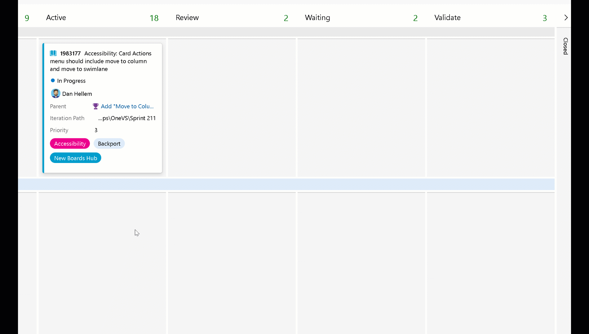

### Move to column and move to swimlane

As part of our accessibility improvements, we have added a **Move to column** and **Move to swimlane** option to the card actions on the Kanban board. These actions give users with accessibility needs the ability move cards around the Kanban board with ease.

> [!NOTE]
> This feature is available with the [**New Boards Hubs** preview](https://devblogs.microsoft.com/devops/new-boards-hub-public-preview/).

> [!div class="mx-imgBorder"]
> 