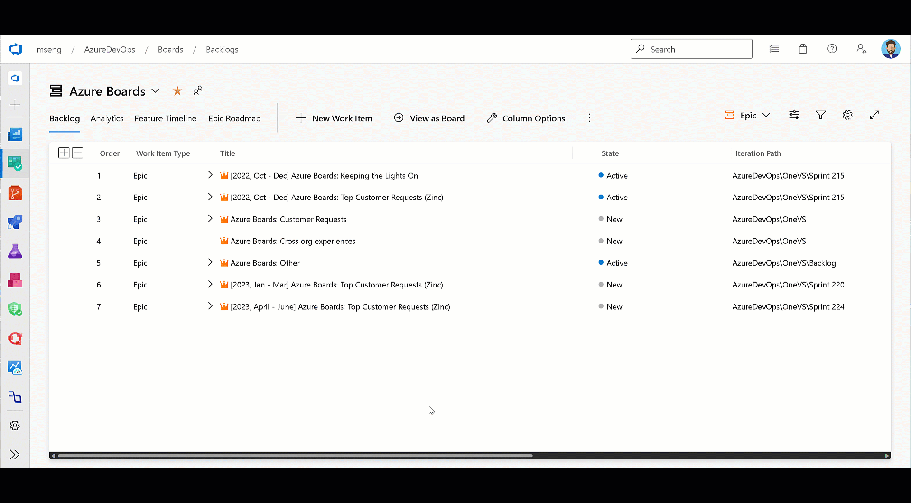
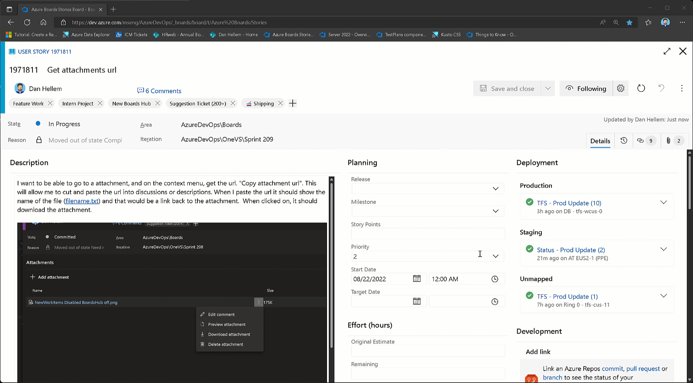

### Option to maintain hierarchy with filters

When filtering on the backlog, your hierarchy gets flattened out in the results and you see just one long list of items. This is a painful experience for folks who want to filter and continue to see the hierarchy. In this sprint, we are releasing a new option for you to maintain the hierarchy when filtering on the backlog. When the filter is applied, we start at the bottom of the hierarchy and work our way back up. If there is match, the work item is highlighted (bold) and you can then see the parent chain above. We are excited to release this feature and looking forward to your feedback.

> [!div class="mx-imgBorder"]
> 

> [!NOTE]
> This feature is available with the [**New Boards Hubs** preview](https://devblogs.microsoft.com/devops/new-boards-hub-public-preview/).

[Community suggestion](https://developercommunity.visualstudio.com/t/boards-backlogs-please-keep-displaying-the-hierarc/366475)

### Copy work item attachment URL

We have added the ability to copy the URL for a work item attachment so that it can be cut and pasted in the description and discussions. When you click on the link, it will download the attachment.

> [!div class="mx-imgBorder"]
> 

> [!NOTE]
> This feature will only be available with the [**New Boards Hubs** preview](https://devblogs.microsoft.com/devops/new-boards-hub-public-preview/).

[Community suggestion](https://developercommunity.visualstudio.com/t/Link-to-attachments-in-Discussion/527072)