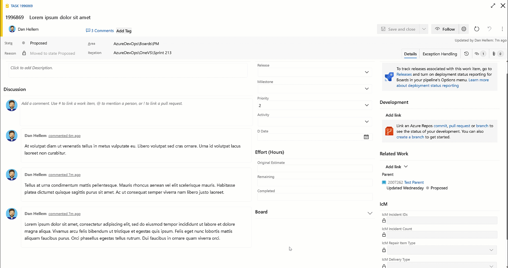

### Copy comment links

You can now use the Copy link action to copy a link to a specific work item comment. You can then paste that link into another work item comment or description. When clicked on, the work item will be opened, and the comment is highlighted.

> [!div class="mx-imgBorder"]
> 

This feature was prioritized based on [this community suggestion ticket](https://developercommunity.visualstudio.com/t/link-to-a-discusion-comment-in-another-work-item/529118).

> [!NOTE]
> This feature will only be available with the [**New Boards Hubs** preview](https://devblogs.microsoft.com/devops/new-boards-hub-public-preview/).
