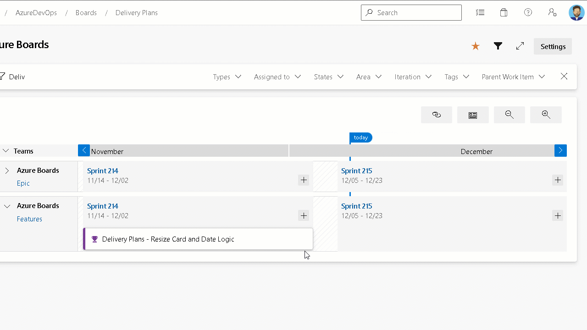

### Card resize logic in Delivery Plans

Not everyone uses target date and/or start date when tracking Features and Epics. Some customers will use a combination of dates and iteration path. In this sprint, we improved the logic to appropriately set the iteration path and date field combinations depending on how they are being used.

For example, if target date is not being used and we resize the card, we set it to the new iteration path instead of updating the target date.

> [!div class="mx-imgBorder"]
> 

### Batch update improvements

We made several changes to the 7.1 version of the work item batch update API. These include:
Minor performance improvements.
Handling of partial failures. Meaning, if one patch fails but the others do not, the others will successfully be completed.
[Click here](https://learn.microsoft.com/en-us/rest/api/azure/devops/wit/?view=azure-devops-rest-7.1#work-item-batch-update-api-) to learn more about the batch update REST API.

### Batch delete API (GA)

This new REST API endpoint to delete and/or destroy work items in batch is now publicly available. [Click here](https://review.learn.microsoft.com/en-us/rest/api/azure/devops/wit/work-items/delete-work-items?view=azure-devops-rest-7.1&branch=mseng%2fusers%2frfrydrysek%2fhack1986677-bulk-delete&tabs=HTTP) to learn more.