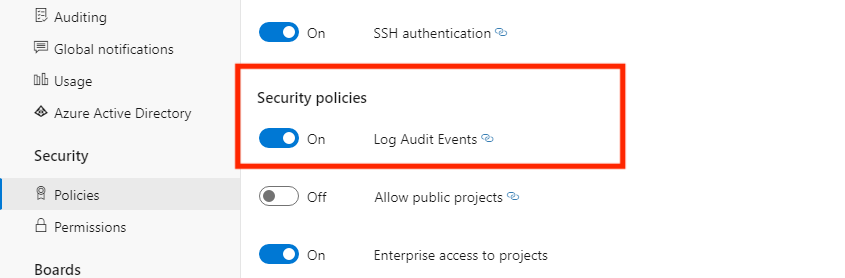

### Auditing is now an opt-in feature for your organization

Auditing has now been made an opt-in feature on Azure DevOps. If your organization does not actively use Auditing today (i.e. have visited Auditing logs at least twice in the past 90 days or have a configured Auditing stream), you will have to explicitly turn *On* the auditing feature for your organization to start doing so. After turning *On*, auditing events will be included in your organization’s audit log. For organizations that are active users of Auditing, the feature will remain *On*. 

You can enable Auditing on your organization from your **Organization settings** page.  

On the right-hand sidebar, you will see **Policies** underneath the Security header. Assuming your organization is backed by Azure Active Directory, you should see that one of the available security policies to enable is **Log Audit Events**. MSA-backed organizations will no longer have the Auditing features available to them.

> [!div class="mx-imgBorder"]
> 
 
Simply toggle this policy **On** and Auditing should now be available (if it does not immediately appear, refresh the page and it should be available). If you no longer want to receive Auditing events, toggle the button to **Off**. When the button is toggled off, the Auditing page will no longer appear in the sidebar and the Auditing Logs page will be unavailable. All configured audit streams will stop receiving events.
### Guest users will only see public user data

When the **External guest access** policy is *disabled* and the **Allow public projects** policy is *enabled*, guest users will only be able to see public user data, like display name, etc., for members of public projects. This is the same experience granted for anonymous users. This applies to any personal data available through the web experience (e.g. in the Identity Picker that appears when a user tries to mention another user or assign work items) and any personal data available through our REST APIs.