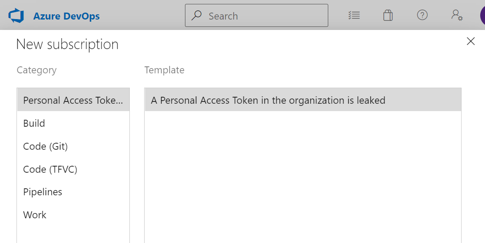

### Project Collection Administrators can opt-in for notifications related to personal access tokens found in a GitHub public repository

Project Collection Administrators can now opt-in to receive notifications when a personal access token (PAT) belonging to a user in their organization is found in a GitHub public repository. 

As a reminder, the Azure DevOps security team, in collaboration with our partners at GitHub, scan for Azure DevOps PATs [checked into public repositories on GitHub](https://devblogs.microsoft.com/devops/mitigating-leaked-personal-access-tokens-pats-found-on-github-public-repositories/) and sends an email notification to the owner of the token, if one is found in a GitHub public repository. This is also logged in the Azure DevOps organization's [Audit Log](/azure/devops/organizations/audit/azure-devops-auditing?view=azure-devops&tabs=preview-page#review-audit-log&preserve-view=true).

Project Collection Administrators can subscribe to these notifications by navigating to 
**User Settings -> Notifications -> New Subscription**

  > [!div class="mx-imgBorder"]
  > 

### Enforcing security validation for all Azure DevOps requests

Azure DevOps will be closing a prior vulnerability that allowed certain users to bypass some security validation when using the *X-TFS-FedAuthRedirect* header to make calls to Azure DevOps resources. Now, all users who use this *X-TFS-FedAuthRedirect* header must always be in compliance with any Azure Active Directory policies set by their tenant and regularly sign in to their Azure DevOps accounts to ensure they always have an active user session.

If you have been using this header and are considered non-compliant, you may experience 401s when making calls with *X-TFS-FedAuthRedirect*. The recommended action for those using this header would be to ensure that your account meets all required admin policies, sign in again to Azure DevOps to get a new user session, and continue signing into to Azure DevOps at least once every 90 days, or the duration of any sign-in frequency checks set by your tenant admins.

This may also apply to users of Visual Studio, as the product may also make calls using the *X-TFS-FedAuthRedirect* header behind-the-scenes. If you come across 401s in the Visual Studio product (i.e. any banners or error messages blocking access to Azure DevOps resources), the same advice above applies. Please ensure that your account meets admin policies, sign in to Azure DevOps again, and continue doing so on a regular cadence to avoid interruptions.
