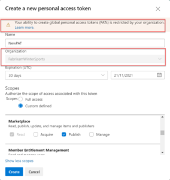

### Create personal access tokens to deploy to the Marketplace 

We have resolved a [known issue](https://devblogs.microsoft.com/devops/issue-with-extension-publishing/) regarding publishing extensions to the Visual Studio Marketplace. If you’ve run into the error message: *Your ability to create global personal access tokens (PATs) is restricted by your organization.*, this is likely because your administrator has enabled [a policy to restrict the creation of global personal access tokens (PATs)](/azure/devops/organizations/accounts/manage-pats-with-policies-for-administrators?view=azure-devops#restrict-creation-of-global-pats&preserve-view=true).

> [!div class="mx-imgBorder"]
> 

Previously, a global PAT was necessary to publish an extension to the Visual Studio Marketplace using the Cross-platform CLI for Azure DevOps (tfx-cli). We have now redesigned the extensions publishing process to accept any PATs with a Marketplace **Publish** scope.

Moving forward, any personal access token with a Marketplace “Publish” scope can be used to publish Azure DevOps and Visual Studio extensions in the Visual Studio Marketplace. This is the case even if the administrator has disabled the creation of global personal access tokens (PATs) policy.