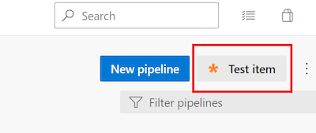
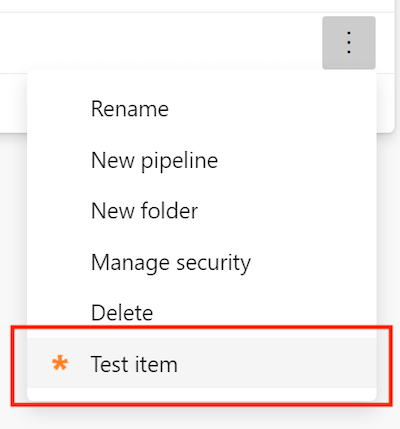

### New extension points for Pipelines details view

We've added two new extensibility points that you can target in your extensions. These extensibility points let you add a custom button in the pipeline header and a custom menu on a pipeline folder:

* Custom button in the pipeline header: `ms.vss-build-web.pipelines-header-menu`
* Custom menu on a pipeline folder: `ms.vss-build-web.pipelines-folder-menu`

To use these new extensibility points, simply add a new contribution that targets them in your [Azure DevOps extension's `vss-extension.json` manifest file](/azure/devops/extend/get-started/node?view=azure-devops&preserve-view=true#create-a-directory-and-manifest).

For example:

```
"contributions": [
        {
            "id": "pipelinesFolderContextMenuTestItem",
            "type": "ms.vss-web.action",
            "description": "Custom menu on a pipeline folder",
            "targets": [
                "ms.vss-build-web.pipelines-folder-menu"
            ],
            "properties": {
                "text": "Test item",
                "title": "ms.vss-code-web.source-item-menu",
                "icon": "images/show-properties.png",
                "group": "actions",
                "uri": "main.html",
                "registeredObjectId": "showProperties"
            }
        },
        {
            "id": "pipelinesHeaderTestButton",
            "type": "ms.vss-web.action",
            "description": "Custom button in the pipeline header",
            "targets": [
                "ms.vss-build-web.pipelines-header-menu"
            ],
            "properties": {
                "text": "Test item",
                "title": "ms.vss-code-web.source-item-menu",
                "icon": "images/show-properties.png",
                "group": "actions",
                "uri": "main.html",
                "registeredObjectId": "showProperties"
            }
        }
]
```

The result will be:

* Custom button in the pipeline header

    > [!div class="mx-imgBorder"]
    > 

* Custom menu on a pipeline folder
    > [!div class="mx-imgBorder"]
    > 
### Improved migration to Azure DevOps Services

When running an import from Azure DevOps Server to Azure DevOps Services, you have to consider that Azure DevOps no longer supports per-pipeline retention rules. With this update, we removed these policies when you migrate to Azure DevOps Services from your on-premises Azure DevOps Server. To learn more about configuring retention policies, see our [documentation on setting retention policies for builds, releases, and tests](/azure/devops/pipelines/policies/retention?view=azure-devops&preserve-view=true&tabs=yaml).

### Improvement to Pipelines Runs REST API

Previously, the [Pipelines Runs REST API](/rest/api/azure/devops/pipelines/runs/get) returned only the `self` repository. With this update, the Pipelines Runs REST API returns all repository resources of a build.