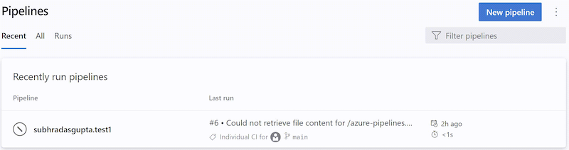

### Support Group Managed Service Accounts as agent service account

The Azure Pipelines agent now supports Group Managed Service Accounts on [Self-hosted agents on Windows](/azure/devops/pipelines/agents/v2-windows?view=azure-devops&preserve-view=true).

[Group Managed Service Accounts (gSMAs)](https://aka.ms/gmsa) provide centralized password management for domain accounts that act as service accounts. The Azure Pipelines Agent can recognize this type of account so a password is not required during configuration:

```PowerShell
.\config.cmd --url https://dev.azure.com/<Organization> `
             --auth pat --token <PAT> `
             --pool <AgentPool> `
             --agent <AgentName> --replace `
             --runAsService `
             --windowsLogonAccount <DOMAIN>\<gMSA>
```
### Informational runs

An informational run tells you Azure DevOps failed to retrieve a YAML pipeline's source code. Such a run looks like the following.

  > [!div class="mx-imgBorder"]
  > 

Azure DevOps retrieves a YAML pipeline's source code in response to external events, for example, a pushed commit, or in response to internal triggers, for example, to check if there are code changes and start a scheduled run or not. When this step fails, the system creates an informational run. These runs are created only if the pipeline's code is in a GitHub or BitBucket repository.

Retrieving a pipeline's YAML code can fail due to:

* Repository provider experiencing an outage
* Request throttling
* Authentication issues
* Unable to retrieve the content of the pipeline's .yml file

Read more about [Informational runs](/azure/devops/pipelines/process/information-run?view=azure-devops&preserve-view=true).

### Build Definition REST API `retentionRules` property is obsolete

In the [Build Definition REST API](/rest/api/azure/devops/build/builds/get)'s `BuildDefinition` response type, the `retentionRules` property is now marked as obsolete, as this property always returns an empty set.
