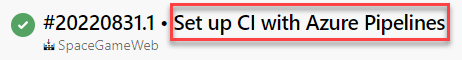
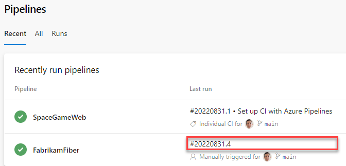
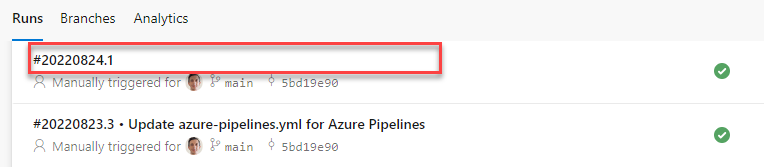
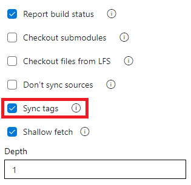

### Disable showing the last commit message for a pipeline run

Previously, the Pipelines UI used to show the last commit message when displaying a pipeline's run.

> [!div class="mx-imgBorder"]
> 

This message can be confusing, for example, when your YAML pipeline's code lives in a repository different from the one that holds the code it's building. We heard your feedback from the [Developer Community](https://developercommunity.visualstudio.com/content/idea/1030999/enabledisable-appending-the-to-the-title-of-every.html) asking us for a way to enable/disable appending the latest commit message to the title of every pipeline run. 

With this update, we've added a new YAML property, named [`appendCommitMessageToRunName`](/azure/devops/pipelines/yaml-schema/pipeline?view=azure-pipelines#pipeline-stages&preserve-view=true), that lets you do exactly that. By default, the property is set to `true`. When you set it to `false`, the pipeline run will only display the [`BuildNumber`](/azure/devops/pipelines/process/run-number?view=azure-devops&tabs=yaml&preserve-view=true).

> [!div class="mx-imgBorder"]
> 

> [!div class="mx-imgBorder"]
> 

### Consumed resources and template parameters in Pipelines Runs Rest API

The extended [Pipelines Runs REST API](/rest/api/azure/devops/pipelines/runs/get?view=azure-devops-rest-7.1&preserve-view=true) now returns more types of artifacts used by a pipeline run and the parameters used to trigger that run. We enhanced the API to return the `container` and `pipeline` resources and the template parameters used in a pipeline run. You can now, for example, write compliance checks that evaluate the repositories, containers, and other pipeline runs used by a pipeline.

Here is an example of the new response body.

```json
"resources":
{
    "repositories":
    {
        "self":
        {
            "repository":
            {
                "id": "e5c55144-277b-49e3-9905-2dc162e3f663",
                "type": "azureReposGit"
            },
            "refName": "refs/heads/main",
            "version": "44153346ecdbbf66c68c20fadf27f53ea1394db7"
        },
        "MyFirstProject":
        {
            "repository":
            {
                "id": "e5c55144-277b-49e3-9905-2dc162e3f663",
                "type": "azureReposGit"
            },
            "refName": "refs/heads/main",
            "version": "44153346ecdbbf66c68c20fadf27f53ea1394db7"
        }
    },
    "pipelines":
    {
        "SourcePipelineResource":
        {
            "pipeline":
            {
                "url": "https://dev.azure.com/fabrikam/20317ad0-ae49-4588-ae92-6263028b4d83/_apis/pipelines/51?revision=3",
                "id": 51,
                "revision": 3,
                "name": "SourcePipeline",
                "folder": "\\source"
            },
            "version": "20220801.1"
        }
    },
    "containers":
    {
        "windowscontainer":
        {
            "container":
            {
                "environment":
                {
                    "Test": "test"
                },
                "mapDockerSocket": false,
                "image": "mcr.microsoft.com/windows/servercore:ltsc2019",
                "options": "-e 'another_test=tst'",
                "volumes":
                [
                    "C:\\Users\\fabrikamuser\\mount-fabrikam:c:\\mount-fabrikam"
                ],
                "ports":
                [
                    "8080:80",
                    "6379"
                ]
            }
        }
    }
},
"templateParameters":
{
    "includeTemplateSteps": "True"
}
```

### Add support for string split function in YAML template expressions

YAML pipelines provide you convenient ways to reduce code duplication, such as [looping through `each` value of a list](/azure/devops/pipelines/process/expressions?view=azure-devops#each-keyword&preserve-view=true) or property of an object. 

Sometimes, the set of items to iterate through is represented as a string. For example, when the list of environments to deploy to is defined by the string `integration1, integration2`.

As we listened to your feedback from the [Developer Community](https://developercommunity2.visualstudio.com/t/Add-support-for-string-split-function-in/1302414), we heard you wanted a string `split` function in YAML template expressions. 

Now, you can `split` a string and iterate over `each` of its substrings.

```yaml 
variables:
  environments: integration1, integration2

jobs:
  - job: Deploy
    steps:
    - ${{ each env in split(variables.environments, ', ') }}:
      - script: ./deploy.sh -e ${{ env }}
      - script: ./runTest.sh -e ${{ env }}
```

### Do not sync tags when fetching a Git repository

The [checkout task](/azure/devops/pipelines/yaml-schema/steps-checkout?view=azure-pipelines&preserve-view=true) uses `--tags` option in fetching the contents of a Git repository. This causes the server to fetch all tags as well as all objects that are pointed to by those tags. This increases the time to run the task in a pipeline - particularly if you have a large repository with a number of tags. Furthermore, the checkout task syncs tags even when you enable the shallow fetch option, thereby possibly defeating its purpose. To reduce the amount of data fetched or pulled from a Git repository, we have now added a new option to the task to control the behavior of syncing tags. This option is available both in classic and YAML pipelines. 

#### [YAML](#tab/yaml/)

This behavior can either be controlled from the YAML file or from the UI.

To opt-out from syncing the tags through YAML file, add the `fetchTags: false` to the checkout step. When the `fetchTags` option is not specified, it's the same as if `fetchTags: true` is used.

```yaml 
steps:
- checkout: self  # self represents the repo where the initial Pipelines YAML file was found
  clean: boolean  # whether to fetch clean each time
  fetchTags: boolean # whether to sync the tags
  fetchDepth: number  # the depth of commits to ask Git to fetch
  lfs: boolean  # whether to download Git-LFS files
  submodules: boolean | recursive  # set to 'true' for a single level of submodules or 'recursive' to get submodules of submodules
  path: string  # path to check out source code, relative to the agent's build directory (e.g. \_work\1)
  persistCredentials: boolean  # set to 'true' to leave the OAuth token in the Git config after the initial fetch
```

If you want to change the behavior of existing YAML pipelines, it may be more convenient to set this option in the UI instead of updating the YAML file. To navigate to the UI, open the YAML editor for the pipeline, select Triggers, then Process, and then the Checkout step.

If you specify this setting both in the YAML file and in the UI, then the value specified in the YAML file takes precedence.

##### [Classic](#tab/classic/)

To opt-out from syncing the tags, uncheck the Sync tags checkbox in the get sources step.

> [!div class="mx-imgBorder"]
> 

---

For all new pipelines you create (YAML or Classic), tags are still synced by default. This option does not change the behavior of existing pipelines. Tags will still be synced in those pipelines unless you explicitly change the option as described above.

### Updated brownout schedule for Ubuntu 18.04 images

Azure Pipelines is deprecating the Ubuntu 18.04 image (`ubuntu-18.04`) on our hosted pools. This image will be retired December 1st. You may start to see longer queue times.

To help you better identify which pipelines are using the ubuntu-18.04 image, we are planning brownouts. Jobs will fail during a brownout period.
* Warning messages are displayed on pipeline runs using the ubuntu-18.04 image
* A [script](https://github.com/microsoft/azure-pipelines-agent/tree/master/tools/FindPipelinesUsingRetiredImages) is available to help you find pipelines using deprecated images, including ubuntu-18.04
* We are scheduling short "brownouts". Any ubuntu-18.04 runs will fail during the brownout period. Therefore, it is recommended to migrate your pipelines prior to the brownouts.
#### Brownout schedule (updated)
* October 3, 12:00 UTC - October 3, 14:00 UTC
* October 18, 14:00 UTC - October 18, 16:00 UTC
* November 15, 18:00 UTC - November 15, 20:00 UTC
* November 30, 20:00 UTC - November 30, 22:00 UTC
* December 15, 20:00 UTC - December 16 00:00 UTC
* January 5, 10.00 UTC - January 5, 14.00 UTC
* January 13, 12.00 UTC - January 13, 16.00 UTC
* January 18, 14.00 UTC - January 18, 18.00 UTC
* January 24, 16.00 UTC - January 24, 20.00 UTC
* February 1, 18.00 UTC - February 1, 22.00 UTC
* February 7, 16.00 UTC - February 7, 22.00 UTC
* February 13, 14.00 UTC - February 13, 22.00 UTC
* February 21, 10.00 UTC - February 21, 22.00 UTC
* February 28, 10.00 UTC - February 28, 22.00 UTC
* March 6, 00.00 UTC - March 7, 00.00 UTC
* March 13, 00.00 UTC - March 14, 00.00 UTC
* March 21, 00.00 UTC - March 22, 00.00 UTC    
