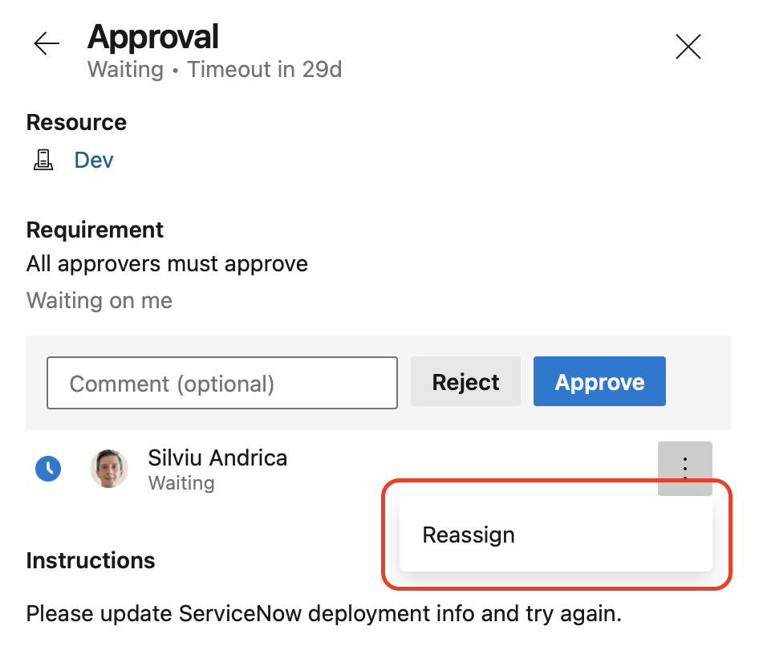
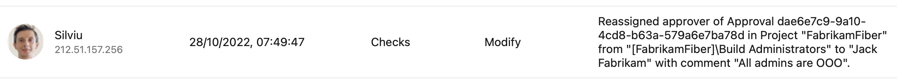

### Template Expressions in Repository Resource Definition

We've added support for template expressions when defining the `ref` property of a `repository` resource in a YAML pipeline. This was a [highly-requested feature by our Developer Community](https://developercommunity.visualstudio.com/t/allow-variables-at-resourcesrepositoriesrepository/816606).

There exist use cases when you want your pipeline to check out different branches of the same repository resource. 

For example, say you have a pipeline that builds its own repository, and for this, it needs to check out a library from a resource repository. Furthermore, say you want your pipeline to check out the same library branch as itself is using. For example, if your pipeline runs on the `main` branch, it should check out the `main` branch of the library repo. If the pipelines runs on the `dev` branch, it should check out the `dev` library branch.

Up until today, you had to explicitly specify the branch to check out, and change the pipeline code whenever the branch changes. 

Now, you can use template expressions to choose the branch of a repository resource. See the following example of 
YAML code to use for the non-main branches of your pipeline:

```yml
resources:
  repositories:
    - repository: library
      type: git
      name: FabrikamLibrary
      ref: ${{ variables['Build.SourceBranch'] }}

steps:
- checkout: library
- script: echo ./build.sh
- script: echo ./test.sh
```

When you run the pipeline, you can specify the branch to check out for the `library` repository.

#### Specify the version of a template to extend at build queue-time

[Templates](/azure/devops/pipelines/process/templates) represent a great way to reduce code duplication _and_ [improve the security of your pipelines](/azure/devops/pipelines/security/templates?). 

One popular use case is to house templates in their own repository. This reduces the coupling between a template and the pipelines that extend it and makes it easier to evolve the template and the pipelines independently. 

Consider the following example, in which a template is used to monitor the execution of a list of steps. The template code is located in the `Templates` repository.

```yml
# template.yml in repository Templates
parameters:
- name: steps
  type: stepList
  default: []

jobs:
- job:
  steps:
  - script: ./startMonitoring.sh
  - ${{ parameters.steps }}
  - script: ./stopMonitoring.sh
```

Say you have a YAML pipeline that extends this template, located in repository `FabrikamFiber`. Up until today, it was not possible to specify the `ref` property of the `templates` repository resource dynamically when using the repository as template source. This meant you had to change the code of the pipeline if you wanted your pipeline to: 
extend a template from a different branch
extend a template from the same branch name as your pipeline, regardless on which branch you ran your pipeline

With the introduction of template expressions in repository resource definition, you can write your pipeline as follows:
```yml
resources:
  repositories:
    - repository: templates
      type: git
      name: Templates
      ref: ${{ variables['Build.SourceBranch'] }}

extends:
  template: template.yml@templates
  parameters:
    steps:
      - script: echo ./build.sh
      - script: echo ./test.sh
```
By doing so, your pipeline will extend the template in the same branch as the branch on which the pipeline runs, so you can make sure your pipeline's and template's branches always match. That is, if you run your pipeline on a branch `dev`, it will extend the template specified by the `template.yml` file in the `dev` branch of the `templates` repository.

Or you can choose, at build queue-time, which template repository branch to use, by writing the following YAML code.
```yml
parameters:
  - name: branch
    default: main

resources:
  repositories:
    - repository: templates
      type: git
      name: Templates
      ref: ${{ parameters.branch }}

extends:
  template: template.yml@templates
  parameters:
    steps:
      - script: echo ./build.sh
      - script: echo ./test.sh

```

Now, you can have your pipeline on branch `main` extend a template from branch `dev` in one run, and extend a template from branch `main` in another run, without changing the code of your pipeline.

When specifying a template expression for the `ref` property of a repository resource, you can use `parameters` and system predefined variables, but you cannot use YAML or Pipelines UI-defined variables.

### Template Expressions in Container Resource Definition

We've added support for template expressions when defining the `endpoint`, `volumes`,  `ports`, and `options` properties of a `container` resource in a YAML pipeline. This was a [highly-requested feature by our Developer Community](https://developercommunity.visualstudio.com/t/allow-variables-at-resourcesrepositoriesrepository/816606).

Now, you can write YAML pipelines like the following.

```yml
parameters:
  - name: endpointName    
    default: AzDOACR
    type: string

resources:
  containers:
    - container: linux
      endpoint: ${{ parameters.endpointName }}
      image: fabrikamfiber.azurecr.io/ubuntu:latest

jobs:
- job:
  container: linux
  steps:
  - task: CmdLine@2
    inputs:
      script: 'echo Hello world'
```

You can use `parameters.` and `variables.` in your template expressions. For variables, you can only use the ones defined in the YAML file, but not those defined in the Pipelines UI. If you redefine the variable, for example, using agent log commands, it will not have any effect.

### Audit Events for Changes to Approvals

[Approvals](/azure/devops/pipelines/process/approvals?view=azure-devops&tabs=check-pass#approvals&preserve-view=true) allow you to control when a stage should run. This is commonly used to control deployments to production environments. [Auditing](/azure/devops/organizations/audit/azure-devops-auditing?view=azure-devops&tabs=preview-page&preserve-view=true) allows you to meet compliance requirements and monitor the security of your Azure DevOps organization.

When a user is asked to approve a pipeline to deploy to a particular stage, that user can choose to reassign the approval to someone else. 

> [!div class="mx-imgBorder"]
> 

Up until now, such actions were not logged in the Audit logs. This issue is fixed now. 

The Audit logs will contain an entry similar to the following.
```json
[
    {
        "Id": "2517368925862632546;00000264-0000-8888-8000-000000000000;839ad1ba-f72b-4258-bc3f-88be7a4553b5",
        "CorrelationId": "8392d1ba-f76b-4258-bc3f-88be7a4553b5",
        "ActivityId": "a298a06c-965f-4e60-9643-2593f2066e37",
        "ActorCUID": "fe950802-bf07-755b-826d-e8dcc066252c",
        "ActorUserId": "fe950802-bf07-755b-826d-e8dcc066252c",
        "ActorUPN": "silviu@fabrikam.app",
        "AuthenticationMechanism": "AAD_Cookie",
        "Timestamp": "2022-10-10T11:26:53.7367453Z",
        "ScopeType": "Organization",
        "ScopeDisplayName": "Fabrikam (Organization)",
        "ScopeId": "547a7316-cdf4-40d2-af16-3215f97d053e",
        "ProjectId": "4bf16944-3595-421f-9947-79d9eb190284",
        "ProjectName": "FabrikamFiber",
        "IpAddress": "127.0.0.1",
        "UserAgent": "Mozilla/5.0 (Windows NT 10.0; Win64; x64) AppleWebKit/537.36 (KHTML, like Gecko) Chrome/106.0.0.0 Safari/537.36 Edg/106.0.1370.37",
        "ActionId": "ApproverReassigned",
        "Data": {
            "ApprovalId": "dae6e7c9-2a10-4cd8-b63a-579a6e7ba78d",
            "OldApproverUserId": "692b6e2a-dd61-4872-866a-85498da390fc",
            "OldApproverDisplayName": "[FabrikamFiber]\\Build Administrators",
            "NewApproverUserId": "fe95080b-bf07-655b-226d-e8dcc066252c",
            "NewApproverDisplayName": "Jack Fabrikam",
            "Comment": "All admins are OOO"
        },
        "Details": "Reassigned approver of Approval dae6e7c9-9a10-4cd8-b63a-579a6e7ba78d in Project \"FabrikamFiber\" from \"[FabrikamFiber]\\Build Administrators\" to \"Jack Fabrikam\" with comment \"All admins are OOO\".",
        "Area": "Checks",
        "Category": "Modify",
        "CategoryDisplayName": "Modify",
        "ActorDisplayName": "Silviu"
    }
]

```

In addition, it will show up in the Audit UI.

> [!div class="mx-imgBorder"]
> 

### Task library exposes Agent hosting model

Task Authors that want to determine whether an agent is running in Microsoft-hosted pools or not can now use Task Library function `getAgentMode()` to determine the hosting model. This is beneficial in scenarios where a task wants to influence behavior based on having access to a customer's network or not. A task may try to reach an Azure service over a private endpoint if it is executed from a self-hosted agent or scale-set agents that reside in a customer's network.
See [task reference](https://github.com/microsoft/azure-pipelines-task-lib/blob/master/node/docs/azure-pipelines-task-lib.md#taskgetAgentMode).
