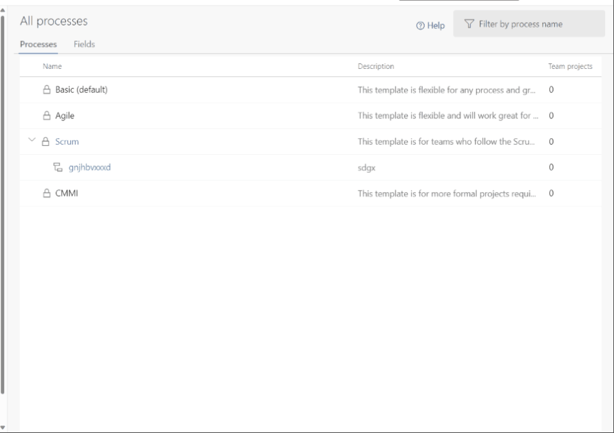
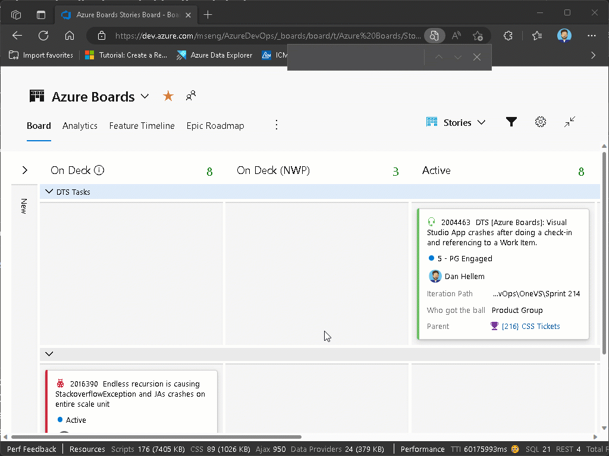

### Prevent editing of shareable picklists fields

Custom fields are shared across processes. This can create a problem for picklist fields because we allow process admins to add or remove values from the field. When doing so, the changes affect that field on every process using it.

To solve this problem, we have added the ability for the collection admin to "lock" a field from being edited. When the picklist field is locked, the local process admin can not change the values of that picklist. They can only add or remove the field from the process.

> [!div class="mx-imgBorder"]
> 

### Swimlane colors

In your Kanban board, swimlanes help you visualize the status of work that supports different service level classes. Now, you can add color to  swimlanes to make them easier to identify in your board.

> [!div class="mx-imgBorder"]
> 

> [!NOTE]
> This feature will only be available with the [**New Boards Hubs** preview](https://devblogs.microsoft.com/devops/new-boards-hub-public-preview/).
