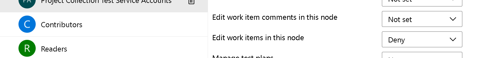
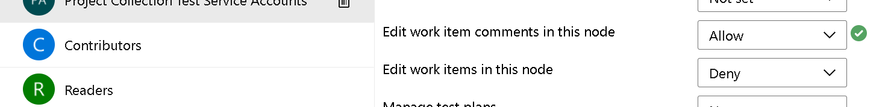
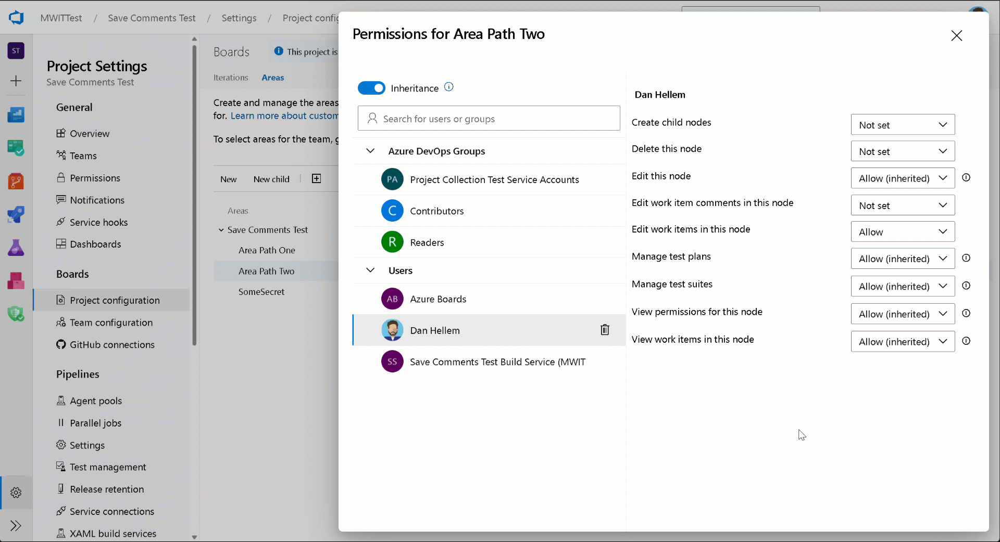

### New save comments permission

The ability to save only work item comments has been a top request in the [developer community](https://developercommunity.visualstudio.com/t/separate-rights-for-work-item-discussion/365819). We are excited to let you know that we have implemented this feature. To begin, let's review the most common scenario:

_"I want to prevent some users from editing work item fields but allow them to contribute to the discussion."_

To accomplish this, you need to go to **Project Settings > Project Configuration > Area Path**. Then select the area path of choice and click Security.

Notice the new permission **"Edit work item comments in this node"**.  By default, the permission is set to **Not set**. Meaning, the work item will behave exactly like it did before. To allow a group or users to save comments, select that group/users and change the permission to **Allow**.

When the user opens the work item form in this area path, they will be able to add comments, but unable to update any of the other fields.

> [!div class="mx-imgBorder"]
> 

We hope you love this feature as much as we do. As always, if you have any feedback or suggestions, [please let us know](https://developercommunity.visualstudio.com/AzureDevOps/suggest).

