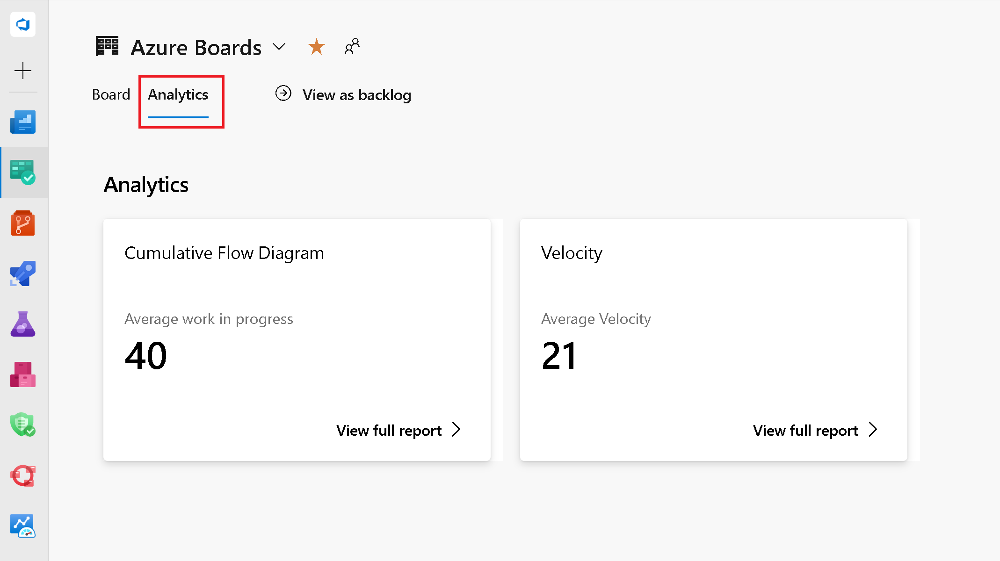

### Interactive Boards Reports

These interactive reports, located in the Boards hub, have been accessible as a preview feature for several years now. They replace the older Cumulative Flow Diagram, Velocity, and Sprint Burndown charts. In this sprint we are taking them out of preview and officially making them generally available

To view these charts, click the Analytics tab location on the Kanban Board, Backlog, and Sprints pages.

> 