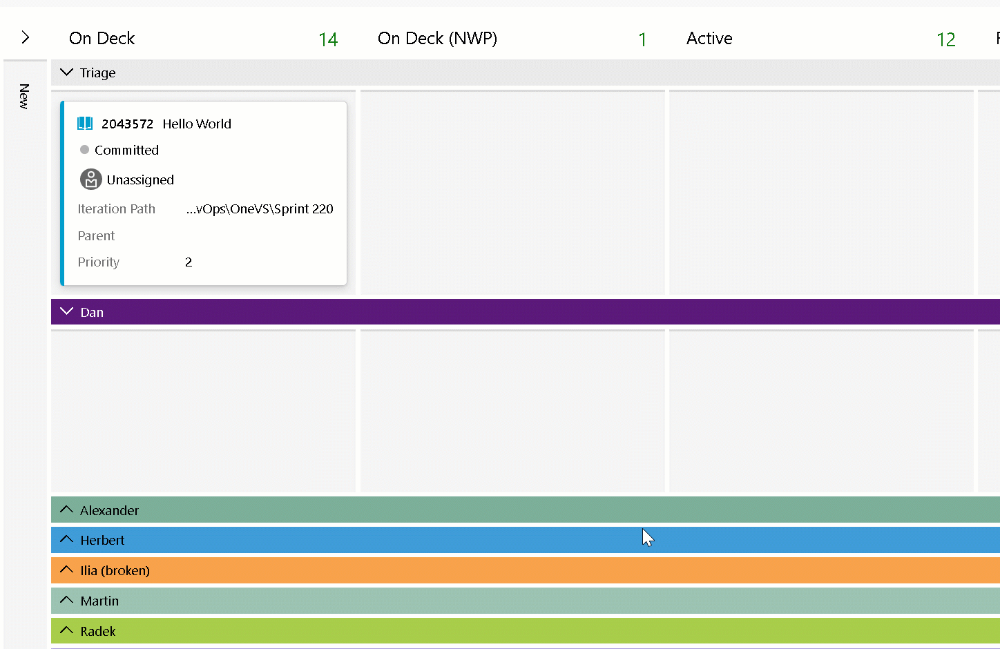

### REST API support for connecting GitHub repositories (preview)

The [Azure Boards-GitHub integration](/azure/devops/boards/github/?view=azure-devops&preserve-view=true) has been available for several years now. It enables the linking between GitHub commits, pull requests, and issues to work items in Boards.  However, the current integration is limited to connecting 250 GitHub repositories to a project and there is no API support.

We are happy to announce a very limited private preview for those customers who are reaching the limits of the current implementation and would like to add more than 250 GitHub repositories to a project. The preview gets you access to a set of new REST APIs that will allow you to build your own tooling to link up to 2,000 repositories per connection.

These endpoints include:
Get list of current connections
Get list of connected repositories
Add repositories
Remove repositories
We will provide all the documentation and code samples to help you on-board into using these new APIs. If you are interested in participating in the limited private preview, please [email us directly](mailto:dahellem@microsoft.com) and be sure to include your organization name (dev.azure.com/{organization}).

### Swimlane rules (preview)

Swimlane rules are similar to style rules, but instead, they allow you to setup conditions on your Kanban board to automatically move work items into specific lanes. For example, you might want all Priority=1 bugs to be placed in the "High Priority" lane and Priority=2 bugs into the "Medium Priority" lane.

> [!div class="mx-imgBorder"]
> 

The feature has been on the backlog since 2018 and is one of [the top voted items](https://developercommunity.visualstudio.com/t/swimlanes-rules/365710) in the work item space. We are excited to finally bring it to customers. We are taking a limited number of requests to be added to the private preview to help us ensure it is ready for production. If you are interested in getting early access to the feature, please [send us an email](mailto:%20dahellem@microsoft.com) and be sure to include the name of your organization (dev.azure.com/{organization}).

[Community suggestion ticket](https://developercommunity.visualstudio.com/t/swimlanes-rules/365710)