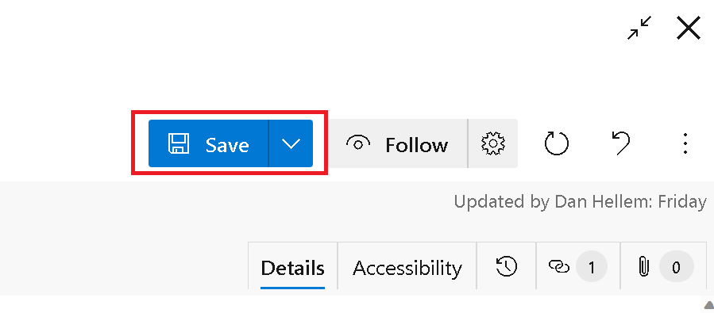

### Sticky "Save" and "Save and Close" button

We added a small usability feature to the work item save button. The button choice between **“Save”** and **“Save and Close”** is now sticky for the next time you save a work item. This prevents making an extra click if you prefer **“Save”** over **“Save and Close”**.

> [!NOTE]
> This feature will only be available with the [**New Boards Hubs** preview](https://devblogs.microsoft.com/devops/new-boards-hub-public-preview/).