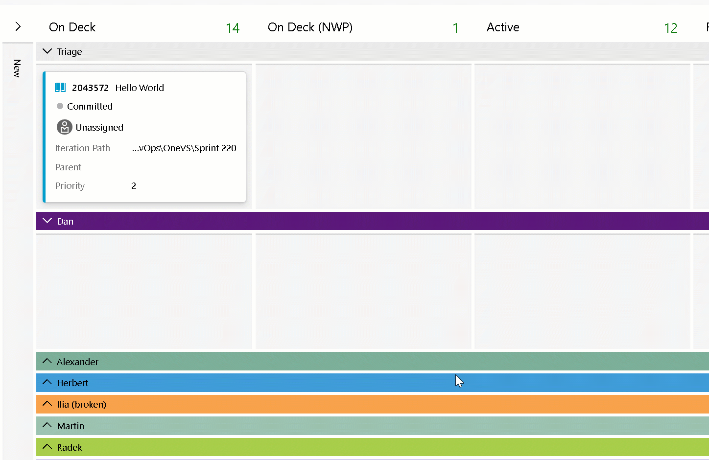

### Swimlane rules are now generally available

In our [March 31st release notes](/azure/devops/release-notes/2023/sprint-219-update#swimlane-rules-private-preview), we announced a private preview for swimlane rules. These past few sprints, we have been fixing bugs and iterating on your feedback. In this sprint we are happy to announce that swimlane rules are now generally available.

Swimlane rules are similar to style rules, but instead, they allow you to setup conditions on your Kanban board to automatically move work items into specific lanes. Here are some example scenarios for using swimlane rules:

* Lanes to track the feature (parent) of your user stories and bugs.
* Lanes to track priority. **Priority=1 bugs** to be placed in the **"High Priority"** lane and **Priority=2 bugs** into the **"Medium Priority"** lane.
* Setup a lane for each person on your team. When you assign the work item, it will be placed into that lane (screenshot below).

> [!div class="mx-imgBorder"]
> 

The feature has been on the backlog for an extended period of time and has been one of the top voted items in the work item space. We are excited to make this feature generally available to all users of the [New Boards Hub preview](/azure/devops/release-notes/2022/sprint-202-update#new-boards-hubs-now-available-in-public-preview). If you have any questions,[please send us an email](mailto:%20dahellem@microsoft.com).

[Community suggestion ticket](https://developercommunity.visualstudio.com/t/swimlanes-rules/365710)