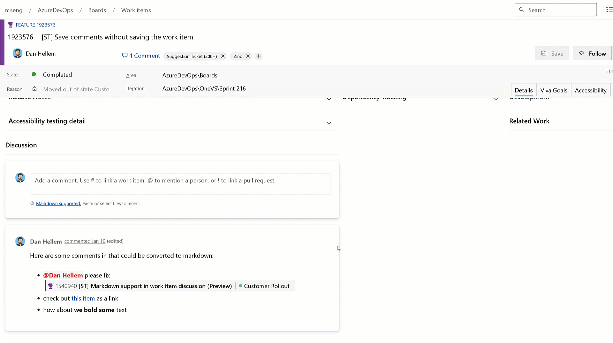

### Markdown support for comments (private preview)

We are happy to finally announce the private preview for the new Markdown editor for work item comments. This feature allows you to use the Markdown syntax and editor for all future comments. The markdown editor matches the experiences you see in other parts of the product like Pull Request comments. Existing work item comments can stay as they are, or you can convert them (one at a time) to Markdown.

* Lanes to track the feature (parent) of your user stories and bugs.
* Lanes to track priority. **Priority=1 bugs** to be placed in the **"High Priority"** lane and **Priority=2 bugs** into the **"Medium Priority"** lane.
* Setup a lane for each person on your team. When you assign the work item, it will be placed into that lane (screenshot below).

> [!div class="mx-imgBorder"]
> 

If you are interested in enrolling in the private preview, please send us an email with your organization name (https://dev.azure.com/{organization}).

This was prioritized based on [this Developer Community suggestion ticket](https://developercommunity.visualstudio.com/t/make-it-easy-to-insert-tables-into-a-work-item-des/1108159).

> [!Important]
> This feature is only available in the [**New Boards Hubs**](https://learn.microsoft.com/azure/devops/release-notes/2022/sprint-202-update#new-boards-hubs-now-available-in-public-preview). Meaning, if you create a comment in New Boards Hub, and then a user opens that work item in Old Boards Hub, the comment will contain the markdown syntax. If this is not okay, please do not enroll in the preview.