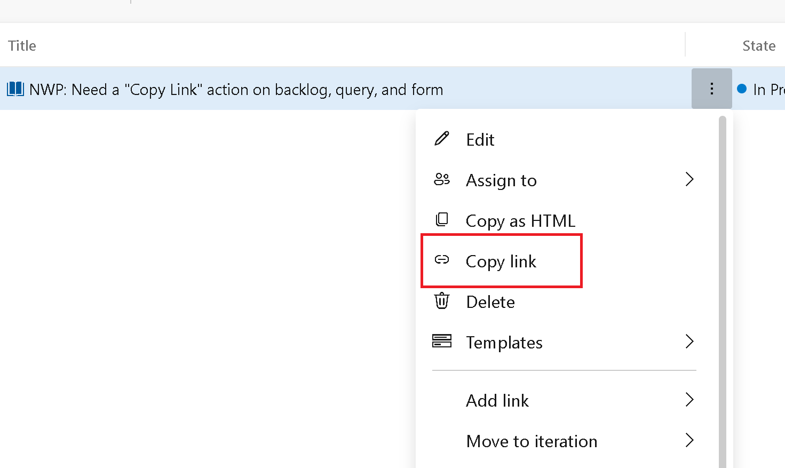

### Copy link to work item

We made a small improvement to copy the work item url from several areas in Azure Boards. Making it easier to get the direct link to a specific work item.

> [!div class="mx-imgBorder"]
> 

**Copy link** has been added to the context menus on the work item form, backlog, and task backlog.

> [!NOTE]
> This feature will only be available with the [**New Boards Hubs** preview](https://devblogs.microsoft.com/devops/new-boards-hub-public-preview/).