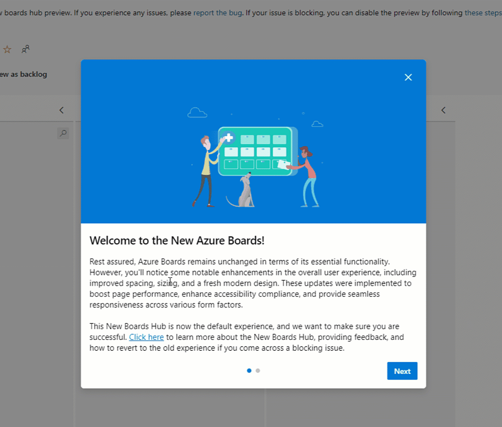

### New Boards Hub on by default

New Boards Hub preview was announced in March of 2022. Since then, we have been taking feedback and fixing bugs.  It has been long journey and we are now confident to take the next step by making New Boards Hub the default experience. This process will take a couple of months as we slowly and thoughtfully roll it out across all the organizations. You will see the following banner when you open Boards for the first time after your organization has been updated.

> [!div class="mx-imgBorder"]
> 

For more information about New Boards Hub and the rollout, please see this [blog post](https://devblogs.microsoft.com/devops/new-boards-hub-path-to-ga/) on the topic.