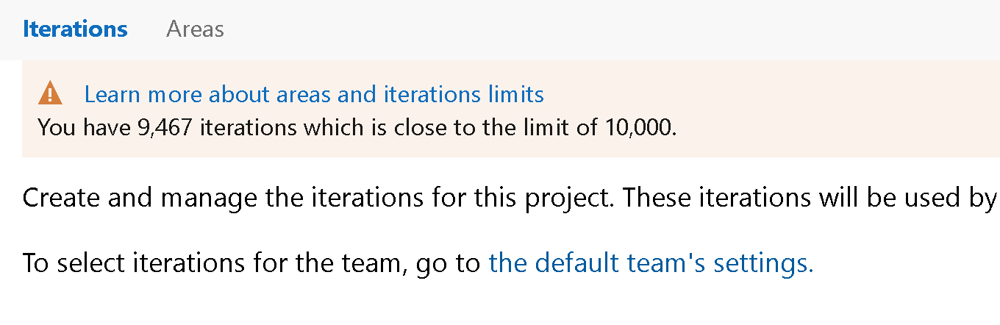

### Limits for Area and Iteration Paths

Limits play an important part in maintaining the health and efficiency of a large, global service. In this sprint, we are introducing hard limits of 10,000 per project for both Area and Iteration paths. [Click here](/azure/devops/organizations/settings/work/object-limits?view=azure-devops&preserve-view=true) to learn more about different limits in the service.

> [!div class="mx-imgBorder"]
> 

