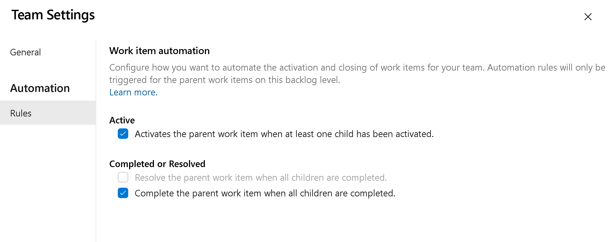

### Team Automation Rules (private preview)

> [!IMPORTANT]
> As of 11/9/2023, we are not taking any new organizations into the private preview. We have had great feedback with just a couple of minor bugs to resolve. We are working on those bugs and will be releasing the feature to everyone in the next few sprints.

You can now configure each backlog level to automate the opening and closing/resolving of work items based on the state(s) of their children. There are two main scenarios we are attempting to solve.

1. When a single child item is activated, then activate the parent.

2. When all child items are closed, then close the parent (or resolve it).

To enable these settings, you click on the backlog level configuration for your team. Then go to the *Automation > Rules* tab to see the two different rules you can apply to your backlog. Each backlog level (requirements, features, epics) can be configured for how your team wants to work.

> [!div class="mx-imgBorder"]
> 

For example, when any child Task is set to Active, make the parent User Story active. Then, when all Tasks are completed, set the User Story to Closed.

> [!div class="mx-imgBorder"]
> 

If you are interested in enrolling in the private preview, please [send us an email](mailto:dahellem@microsoft.com) with your organization name (dev.azure.com/{organization name}). Please understand that we will be limiting the number of organizations into the preview. Our hope is to get a few organizations to provide feedback and then release to everyone within 2-3 sprints.

The features was prioritized based on [this Developer Community suggestion ticket](https://developercommunity.visualstudio.com/t/update-automatically-user-story-state-according-to/376465).

> [!NOTE]
> This feature will only be available with the [**New Boards Hubs** preview](https://devblogs.microsoft.com/devops/new-boards-hub-public-preview/).