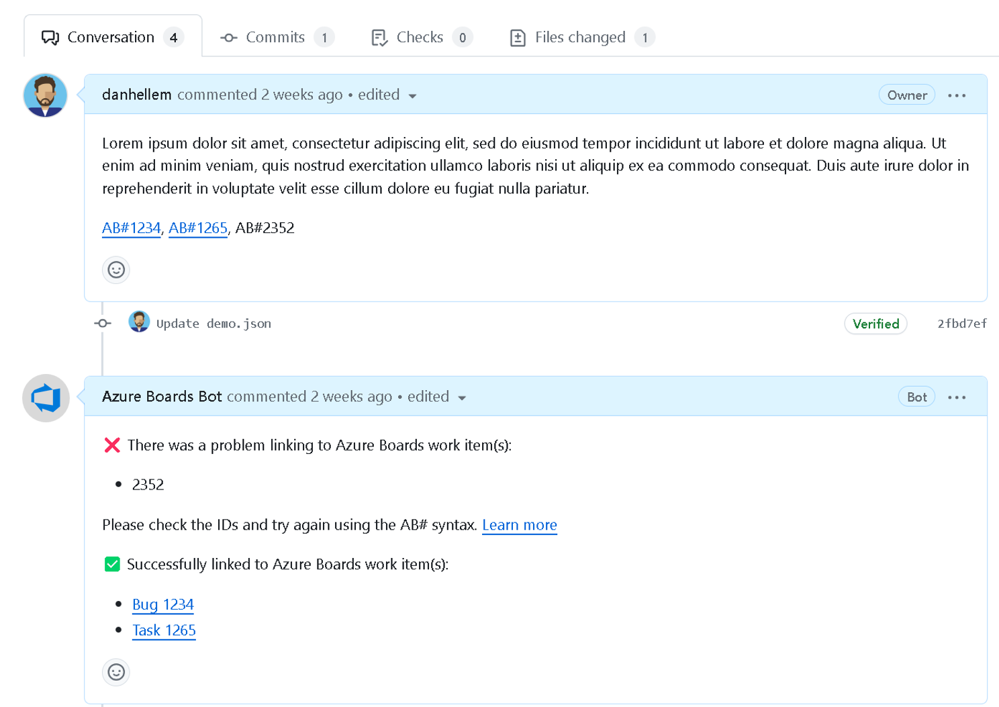

### GitHub Integration - Improved AB# validation (private preview)

> [!IMPORTANT]
> As of 8/6/2024, the Azure Boards App in GitHub will no longer validate AB# links. You can still use the `AB#` syntax to link work items in your GitHub pull requests, commits, and issues as you could prior to this change.

We're starting our journey of Boards + GitHub integration improvements by addressing the bot responses when linking to work items using the AB# syntax. When you link to a Pull Request using the ``AB#{ID}`` syntax, the only way to know if the link was successful is by looking at the work item or noticing the ``AB#{ID}`` turn into a link.

Today, we're launching a private preview featuring several enhancements to the Azure Boards GitHub app to better inform you when a link to a work item is valid or invalid. This helps identify bad links and fix them before the Pull Request is merged.

> [!div class="mx-imgBorder"]
> 

If you're interested in participating in the private preview, reach out to us directly [via email](mailto:dahellem@microsoft.com). Be sure to include your organization name (dev.azure.com/{organization})

Check out the public roadmap to learn more about upcoming [Azure Boards + GitHub integration features](/azure/devops/release-notes/features-timeline#improved-boards--github-integration).