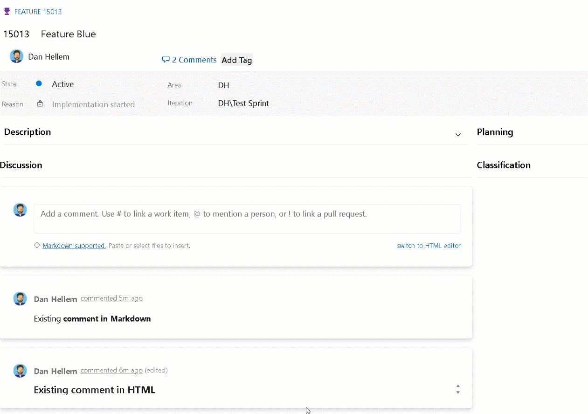

### Switch between HTML or Markdown on comments

A few months ago, we [introduced a private preview](/azure/devops/release-notes/2023/sprint-222-update#azure-boards-1) to enable Markdown for comments on work items, aiming to replace the existing HTML editor entirely. We've received your feedback, expressing a preference for the HTML editor and we adjusted our approach. You now have the flexibility to switch between the HTML and Markdown editor at the comment level.

> [!div class="mx-imgBorder"]
> 

Here's what you should expect:

* The default editor is sticky from the last comment you created.
* You can convert existing HTML comments to Markdown.
* Once a Markdown comment is created or updated, it can't be converted to HTML.

This update is implemented across all pre-enrolled organizations and those with the New Boards Hub enabled by default. Additionally, we're extending the preview period for a few more weeks to gather more feedback. If you're interested in enrolling in the private preview, feel free to reach out directly [via email](mailto:dahellem@microsoft.com), and kindly include your organization name (dev.azure.com/{organization}).

> [!TIP]
> Consider enrolling in the preview only if your organization is fully committed to utilizing the [New Boards Hub](/azure/devops/release-notes/2022/sprint-202-update) for all users. The experience with Markdown comments in the Old Boards may not be optimal.
