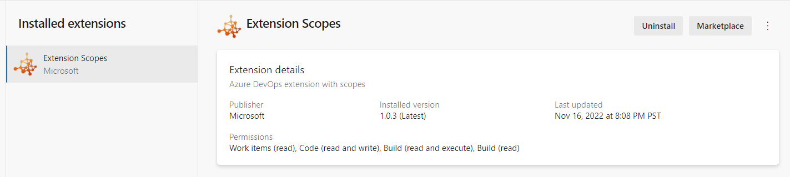

### Extensions should display their Scopes 

When installing extensions to your Azure DevOps organization, you can review the permissions the extension needs as part of the installation. However, once they are installed, the extension permissions are not visible in the extension settings. This has posed a challenge for administrators needing to perform a periodic review of installed extensions. In this sprint, we have added the extension permissions to extension settings to help you review and take an informed decision on whether to keep them or not.

> [!div class="mx-imgBorder"]
> 
