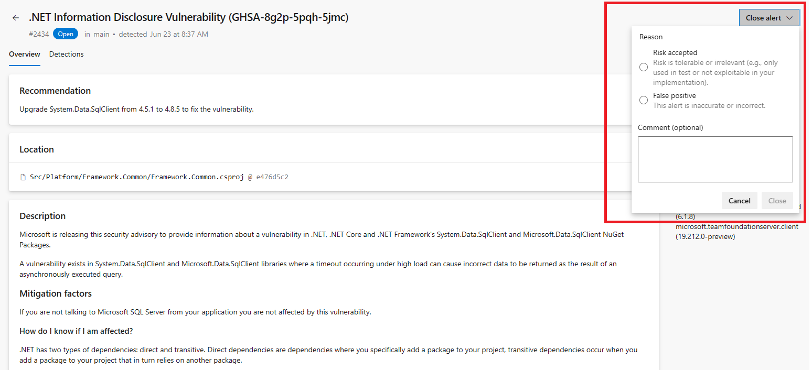

### Alert dismissals for dependency scanning alerts in Advanced Security 

You can now dismiss any dependency scanning alerts you believe to be a false positive or acceptable risk. These are the same dismissal options for secret scanning and code scanning alerts in Advanced Security that you can currently use. 

> [!div class="mx-imgBorder"]
> 

Note that you may need to re-run detection pipeline with the dependency scanning task as well as ensure you have the `Advanced Security: dismiss alerts` permissions in order to dismiss these alerts. 

To learn more about alert dismissals, see [Dismiss dependency scanning alerts](/azure/devops/repos/security/github-advanced-security-dependency-scanning?view=azure-devops#dismiss-dependency-scanning-alerts).