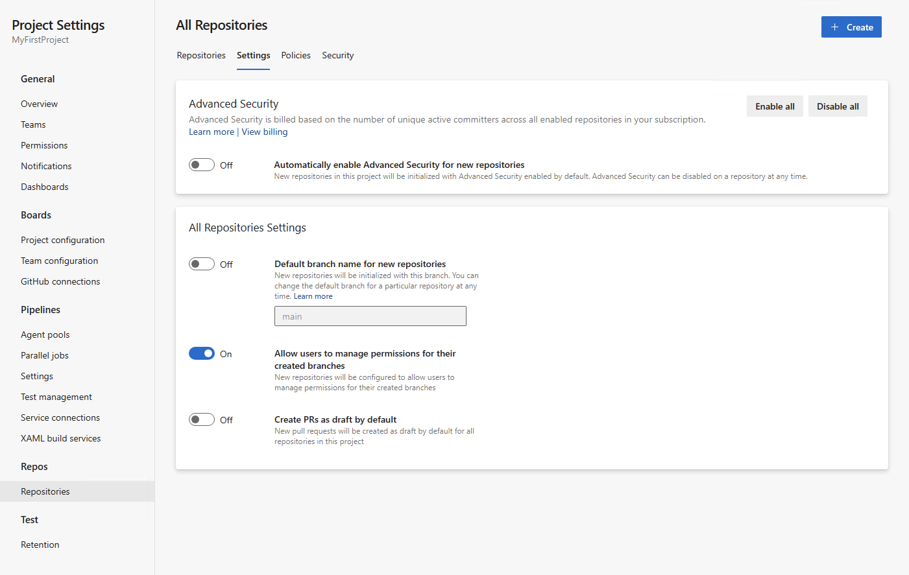
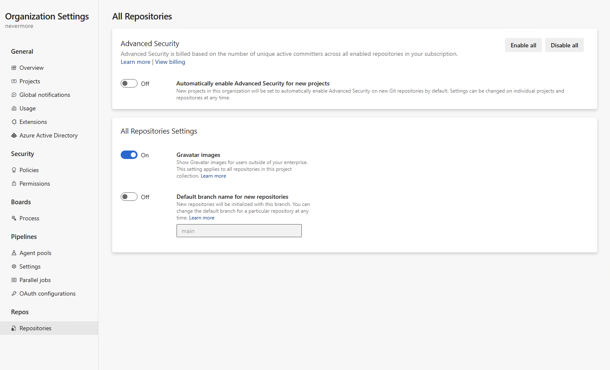
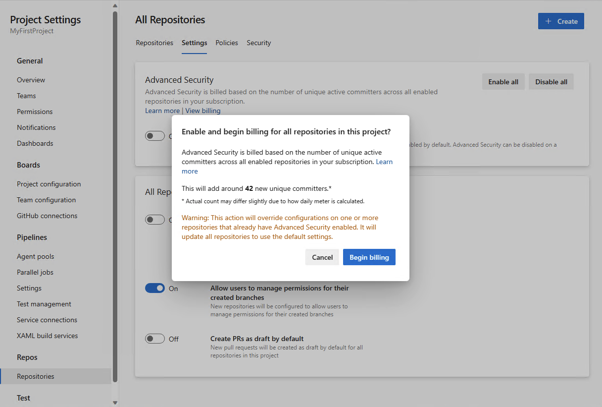

### Project and organization-level enablement for Advanced Security 

You can now enable or disable **Advanced Security** for your entire project or organization. In conjunction with the new addition of displaying committer count prior to enablement, selecting **"Enable all"** at the project or organization-level will provide you with an estimate of how many new active committers you may be billed for. You can also opt to automatically enable **Advanced Security** for any newly created repositories or projects under your respective project or organization. Any repositories enabled through this setting will have secret repository scanning and push protection active.  

**Project-level enablement:**

> [!div class="mx-imgBorder"]
> 

**Organization-level enablement:**

> [!div class="mx-imgBorder"]
> 

### Estimated committer count during Advanced Security enablement 

As a part of your **Advanced Security** onboarding experience, you can now see an estimate of how many active committers may have been added as a result of enabling **Advanced Security** for a particular repository, project, or organization. This count is an approximation and you may see slight discrepancies between the provided estimate and what is reported for billing after enablement. This estimate can also be obtained via API with additional documentation explaining this process coming soon. 

> [!div class="mx-imgBorder"]
> 
