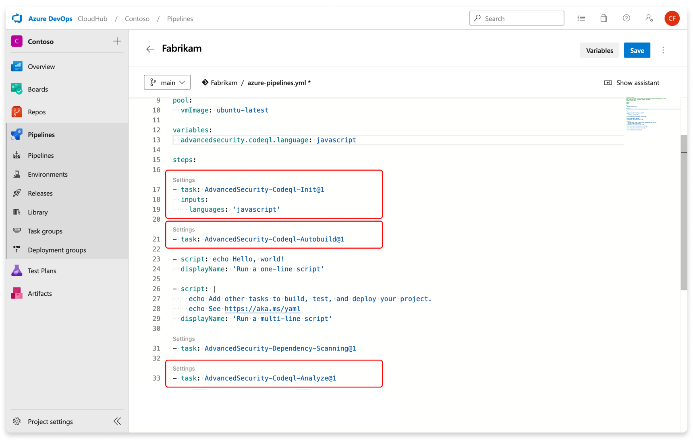

### Changes to Code Scanning (CodeQL) user input task and variables

All user-provided inputs are now specified in the CodeQL Initialize task, which is responsible for configuring the CodeQL analysis environment used for code analysis with CodeQL `AdvancedSecurity-Codeql-Init@1``. See the [configure GitHub Advanced Security for Azure DevOps features documentation](/azure/devops/repos/security/configure-github-advanced-security-features?view=azure-devops&tabs=yaml) for more information on configuring GitHub Advanced Security for Azure DevOps. 

In addition, user inputs take precedence over any values set by variables. For instance, if you establish the language variable as `advancedsecurity.codeql.language: Java` and subsequently, during the CodeQL initialization phase, you specify the language as an input with `Language: cpp,` the input `cpp` will override the variable `Java` for the language. Please ensure that your inputs are configured accurately.

### Publish task is no longer required for Setting up code Scanning

Previously, when configuring code scanning, you were required to include the publish task (AdvancedSecurity-Publish@1) in either the YAML pipeline or classic pipeline. With this update, we've eliminated the need for the publish task, and the results are now directly posted to the advanced security service within the analyze task (AdvancedSecurity-Codeql-Analyze@1).

Below are the require task for code scanning. 

> [!div class="mx-imgBorder"]
> 

For more information, please refer to the set up code scanning [documentation](/azure/devops/repos/security/configure-github-advanced-security-features?view=azure-devops&tabs=yaml#set-up-code-scanning).

### CodeQL code scanning now supports Swift

We're expanding our support for CodeQL code scanning to include Swift! This means that developers working on Swift libraries and applications for Apple platforms can now take advantage of our top-notch code security analysis. Our current capabilities include the detection of issues such as path injection, risky web view fetches, various cryptographic misuses, and other forms of unsafe handling or processing of unfiltered user data.

Swift is now part of our roster of supported programming languages, which includes C/C++, Java/Kotlin, JavaScript/TypeScript, Python, Ruby, C#, and Go. Altogether, these languages enable us to perform nearly 400 comprehensive checks on your code, all while maintaining a low rate of false positives and ensuring high precision.

See the [configure GitHub Advanced Security for Azure DevOps features documentation](/azure/devops/repos/security/configure-github-advanced-security-features?view=azure-devops&tabs=yaml) for more information on configuring GitHub Advanced Security for Azure DevOps for your repositories.

