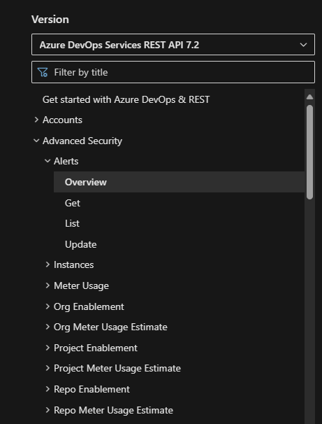

### REST API documentation now available for Advanced Security 

Documentation for the Advanced Security REST APIs is now available through the [Azure DevOps Services REST API Reference](/azure/devops/?view=azure-devops-rest-7.2&preserve-view=true) under the Advanced Security section. There are a range of APIs available for use, from security alert finding details, enablement and meter usage estimates.

> [!div class="mx-imgBorder"]
> 