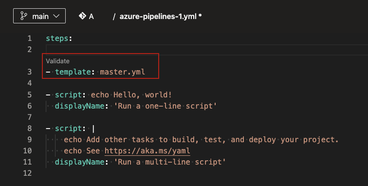

### Support for Tokyo version of ServiceNow

Azure Pipelines has an existing integration with ServiceNow. The integration relies on an [app](https://store.servicenow.com/sn_appstore_store.do#!/store/application/fa788cb5dbb5630040669c27db961940) in ServiceNow and an [extension](https://marketplace.visualstudio.com/items?itemName=ms-vscs-rm.vss-services-servicenowchangerequestmanagement) in Azure DevOps. We've now updated the app to work with the Tokyo version of ServiceNow. Both classic and YAML pipelines now work with Tokyo. To ensure that this integration works, upgrade to the new version of the app (4.215.2) from the Service Now store. For more information, see [Integrate with ServiceNow Change Management](/azure/devops/pipelines/release/approvals/servicenow?view=azure-devops&preserve-view=true).

### New predefined system variable

We introduced a new predefined system variable, named `Build.DefinitionFolderPath`, whose value is the folder path of a build pipeline definition. The variable is available in both YAML and classic build pipelines. 

For example, if your pipeline is housed under the `FabrikamFiber\Chat` folder in Azure Pipelines, then the value of `Build.DefinitionFolderPath` is `FabrikamFiber\Chat`.

### General Availability template support in YAML editor

[Templates](/azure/devops/pipelines/process/templates?view=azure-devops&preserve-view=true) are a commonly used feature in YAML pipelines. They are an easy way to share pipeline snippets. They are also a powerful mechanism in verifying or enforcing [security and governance](/azure/devops/pipelines/security/templates?view=azure-devops&preserve-view=true) through your pipeline.

Azure Pipelines supports a YAML editor, which can be helpful when editing your pipeline. However the editor did not support templates until now. Authors of YAML pipelines could not get assistance through intellisense when using a template. Template authors could not make use of the YAML editor.  In this release, we are adding support for templates in the YAML editor. 

As you edit your main Azure Pipelines YAML file, you can either _include_ or _extend_ a template. When you type in the name of your template, you will be prompted to validate your template. Once validated, the YAML editor understands the schema of the template including the input parameters.

> [!div class="mx-imgBorder"]
> 

Post validation, you can choose to navigate into the template. You will be able to make changes to the template using all the features of the YAML editor.

There are known limitations:
If the template has required parameters that are not provided as inputs in the main YAML file, then the validation fails and prompts you to provide those inputs. In an ideal experience, the validation should not be blocked, and you should be able to fill in the input parameters using intellisense.
You cannot create a new template from the editor. You can only use or edit existing templates.

