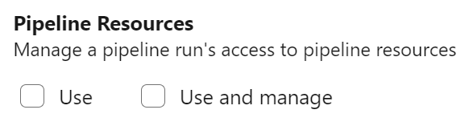
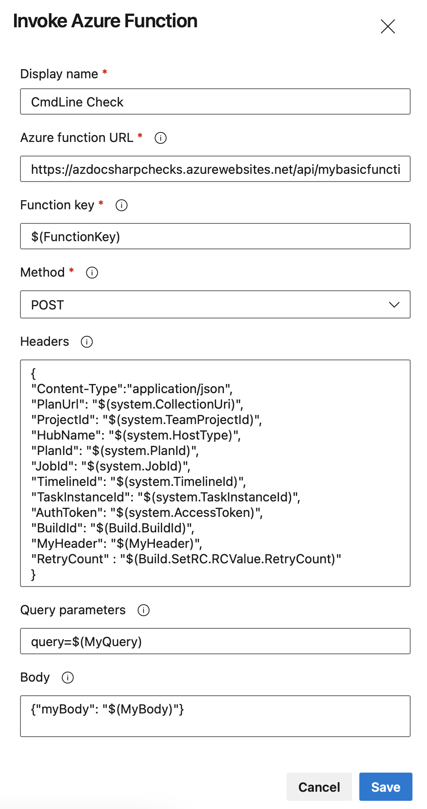
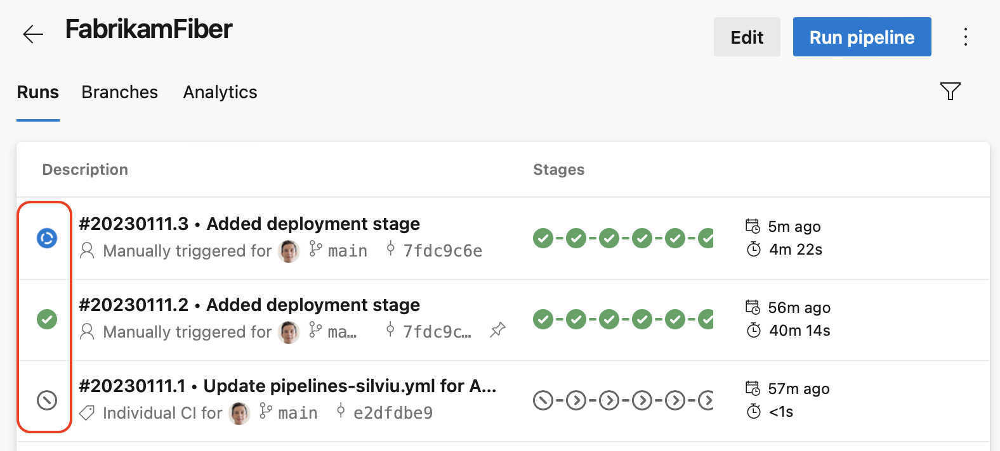

### New PAT Scope for managing pipeline authorization and approvals and checks

To limit damage done by leaking a PAT token, we've added a new PAT scope, named `Pipeline Resources`. You can use this PAT scope when managing pipeline authorization using a [protected resource](https://learn.microsoft.com/azure/devops/pipelines/security/resources?view=azure-devops#protected-resources), such as a service connection, or to manage [approvals and checks](https://learn.microsoft.com/azure/devops/pipelines/process/approvals) for that resource.

> [!div class="mx-imgBorder"]
> 

The following REST API calls support the new PAT scope as follows:

* [Update an Approval](https://learn.microsoft.com/rest/api/azure/devops/approvalsandchecks/approvals/update) supports scope `Pipeline Resources Use` 
* [Manage Checks](https://learn.microsoft.com/rest/api/azure/devops/approvalsandchecks/check-configurations) supports scope `Pipeline Resources Use and Manage` 
* [Update Pipeline Permissions For Resources](https://learn.microsoft.com/rest/api/azure/devops/approvalsandchecks/pipeline-permissions/update-pipeline-permisions-for-resources) supports scope `Pipeline Resources Use and Manage` 
* [Authorize Definition Resources](https://learn.microsoft.com/rest/api/azure/devops/build/resources/authorize-definition-resources) supports scope `Pipeline Resources Use and Manage` 
* [Authorize Project Resources](https://learn.microsoft.com/rest/api/azure/devops/build/authorizedresources/authorize-project-resources) supports scope `Pipeline Resources Use and Manage`

### Experience improvements to pipeline permissions

We've improved the experience around managing pipeline permissions to make the permissions system remember if a pipeline had previously used a protected resource, such as a service connection.

In the past, if you checked off "Grant access permission to all pipelines" when you created a protected resource, but then you restricted access to the resource, your pipeline needed a new authorization to use the resource. This behavior was inconsistent with subsequent opening and closing access to the resource, where a new authorization wasn't required. This is now fixed.
### Variables as inputs in checks

[Approvals and checks](https://learn.microsoft.com/azure/devops/pipelines/process/approvals) are a runtime security mechanism that allows resource owners to control which pipeline _runs_ can use their resource. 

Two popular checks are _Invoke Azure Function_ and _Invoke REST API_. In the past, when configuring them, one could only use [predefined system variables](https://learn.microsoft.com/azure/devops/pipelines/build/variables) or [variable groups](https://learn.microsoft.com/azure/devops/pipelines/library/variable-groups).

In this sprint, we've added support for pipeline-defined variables. This works when specifying `Function key`, `Headers`, `Body`, and `Query` parameters for such checks. 

Say you have the following YAML pipeline. Notice we define variables `FunctionKey`, `MyHeader`, `MyBody`, and `MyQuery`, and a runtime-defined variable named`RetryCount`.

```yaml
variables:
  FunctionKey: <<redacted>>
  MyHeader: "FabrikamHeader"
  MyQuery: "FabrikamQuery"
  MyBody: "FabrikamBody"

stages: 
- stage: Build
  jobs:
  - job: SetRC
    steps:
    - script: echo "##vso[task.setvariable variable=RetryCount;isOutput=true]3"
      name: RCValue
- stage: Deploy
  jobs:
  - deployment: 
    environment: Production
    strategy:
      runOnce:
        deploy:
          steps:
          - script: ./deploy.sh
```
You can configure an Invoke Azure Function check on the Production environment and reference `$(FunctionKey)`, `$(MyHeader)`, `$(MyBody)`, `$(MyQuery)`, and `$(Build.SetRC.RCValue.RetryCount)`, like in the following screenshot.

> [!div class="mx-imgBorder"]
> 

The syntax for using runtime-defined variables is `StageId.JobId.StepOrTaskName.Variable`.

Learn more about [the recommended way to use Invoke Azure Function & REST API checks](https://learn.microsoft.com/azure/devops/pipelines/process/invoke-checks).
### Ability to disable masking for short secrets

Azure Pipelines masks secrets in logs. Secrets can be variables marked as secret, variables from variable groups that are linked to Azure Key Vault or elements of a Service Connection marked as secret by the Service Connection provider.

All occurrences of secret value are masked. Masking short secrets e.g. '`1`', '`2`', '`Dev`' makes it easy to guess their values e.g. in a date: '`Jan 3, 202***`'   
It's now clear '`3`' is a secret. In such cases you may prefer not masking the secret altogether. If it's not possible to not mark the value as secret (e.g. the value is taken from Key Vault), you can set the `AZP_IGNORE_SECRETS_SHORTER_THAN` knob to a value of up to 4.

### Script to self-validate pipeline agent version

We currently have two versions of the Pipeline agent: v2 uses .NET 3.1 Core and v3 uses .NET 6. We're slowly rolling out the v3 agent to supported operating systems, after which we'll retire the v2 agent. For more information, see [the upgrade of .NET agent for Azure Pipelines blog post](https://aka.ms/azdo-pipeline-agent-version).

We have created a [script](https://github.com/microsoft/azure-pipelines-agent/tree/master/tools/FindAgentsNotCompatibleWithAgent) to help you verify if your self-hosted agents will be able to upgrade. This script will process all pools in your organization and identify v2 agents on operating systems that are not supported by the v3 agent, e.g. CentOS 6, Fedora versions before 31, macOS 10.14, RHEL 6.

> [!NOTE]
> Recent builds of the v2 agent will not try to auto-upgrade to the v3 agent on an operating system known not to be compatible with it.

### Pipeline run status overview icon

In this sprint, we're making it easier to know the overall status of a pipeline run. 

For YAML pipelines that have many stages, it used to be hard to know the status of a pipeline run, that is, is it still running or it finished. And if it finished, what is the overall state: successful, failed, or canceled. We fixed this issue by adding a run status overview icon.
> 
