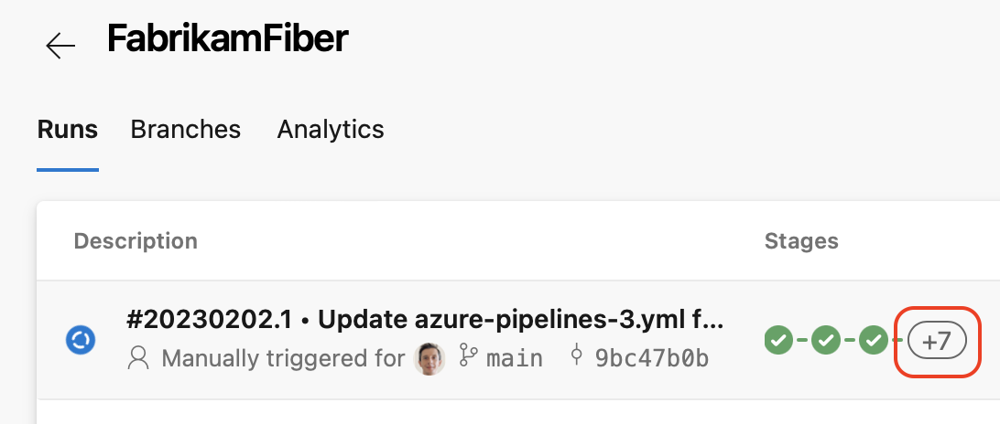
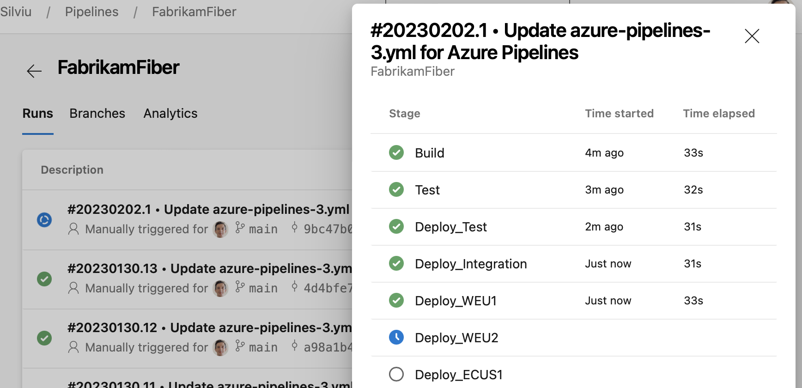
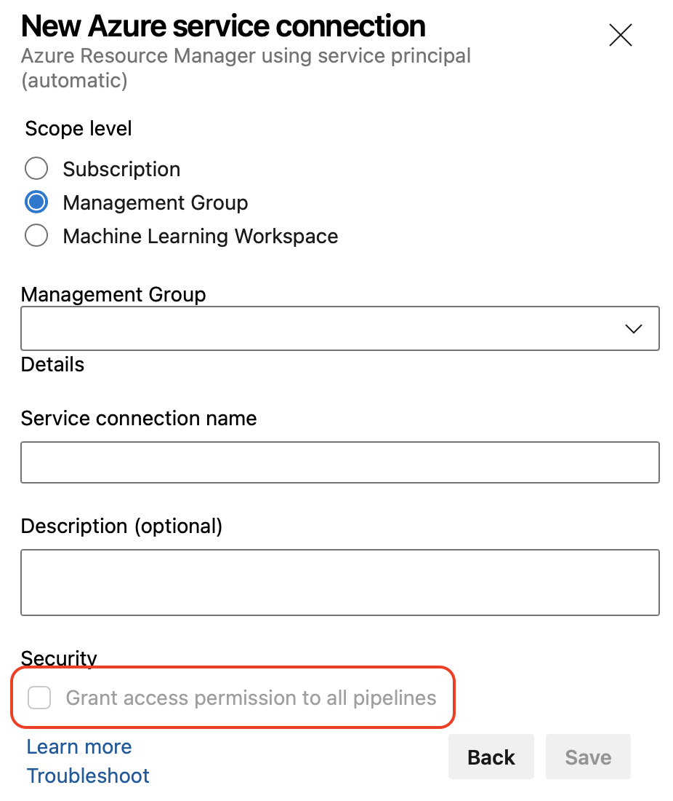
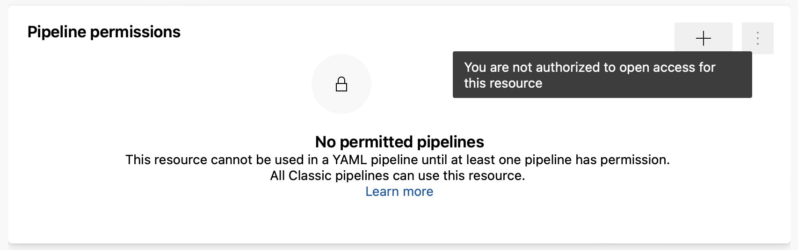

### Red Hat 6 will no longer receive Pipeline agent updates

Pipeline agents running Red Hat 6 will no longer receive updates after agent version v2.214.2. If you are still using Red Hat 6 upgrade or replaced Red Hat 6 agents with a compatible operating system version. To alert you of running the last agent version released for Red Hat 6, an agent knob is required to be set for continuous agent operation. 

For more details and answers to frequently asked questions please visit our [blog post](https://aka.ms/azdo-pipeline-agent-rhel6) .

### Pipeline stages side panel

YAML pipelines can have tens of stages, and not all of them will fit on your screen. While the pipeline run overview icon tells you the overall state of your run, it is still hard to know which stage failed, or which stage is still running, for example.

In this sprint, we've added a pipeline stages side panel that lets you quickly see the state of all your stages. You can then click on a stage and get directly to its logs.

> [!div class="mx-imgBorder"]
> 

> [!div class="mx-imgBorder"]
> 

### Restrict opening protected resources to resource administrators

To improve the security of resources that are critical to your ability to securely build and deploy your applications, Azure Pipelines now requires resource-type administrator role when opening up access to a resource to all pipelines.

For example, a general Service Connections Administrator role is required to allow *any* pipeline to use a service connection.. This restriction applies when creating a protected resource or when editing its Security configuration.

In addition, when creating a service connection, and you don't have sufficient rights, the **Grant access permission to all pipelines** option is disabled.

> [!div class="mx-imgBorder"]
> 

Also, when trying to open access to an existing resource and you don't have sufficient rights, you'll get a _You are not authorized to open access for this resource_ message.

> [!div class="mx-imgBorder"]
> 
