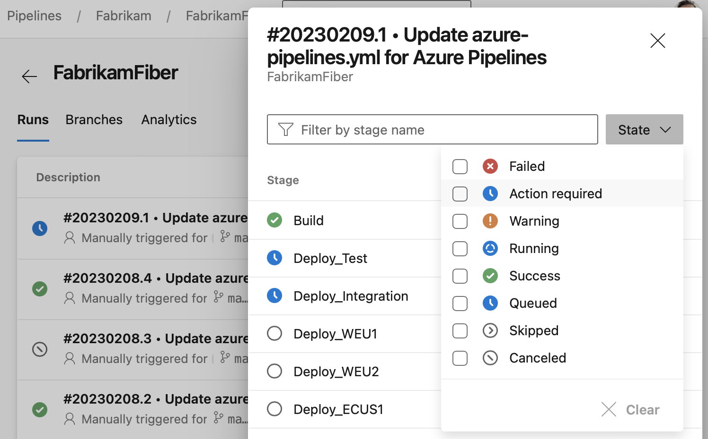

### Search for stages in side panel

We've made it easier to find the stages you're looking for in the stages side panel. You can now quickly filter for stages based on their status, for example running stages or those that require manual intervention. You can also search for stages by their name. 

> [!div class="mx-imgBorder"]
> 

### Pipeline agent v3 (.NET 6) rolling out

In the coming weeks, we will roll out the .NET 6 based Pipeline Agent v3. This will impact both hosted and self-hosted agents. Any agents running on an operating system not compatible with .NET 6 will not get upgraded, and will continue to use agent v2. This does not impact builds targeting .NET. For more information and frequently asked questions, see the [agent v3 doc page](https://aka.ms/azdo-pipeline-agent-version).