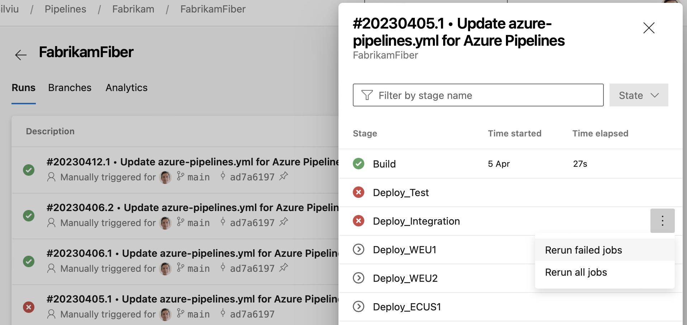

### Stage quick actions

A pipeline's Runs screen gives you quick access to all a run's stages. In this sprint, we added actions to each stage, so you can easily rerun failed jobs or rerun the entire stage.
> [!div class="mx-imgBorder"]
> 